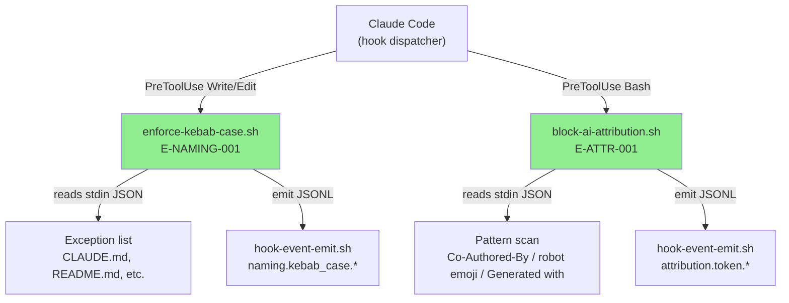
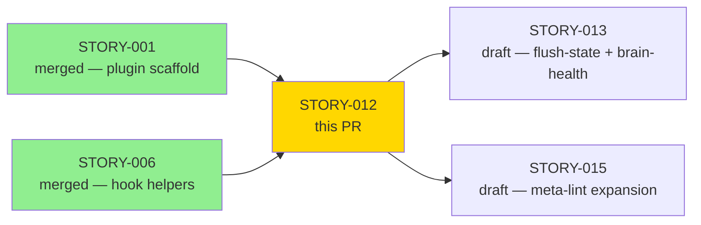
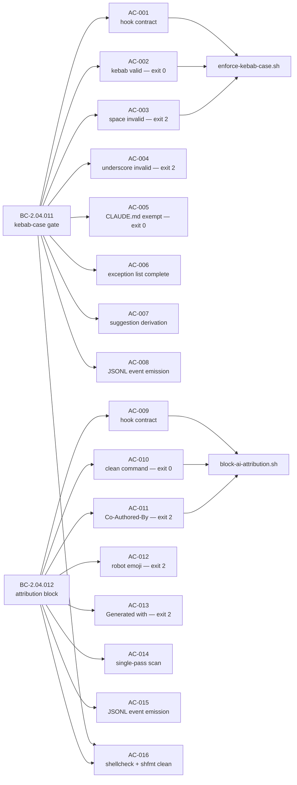
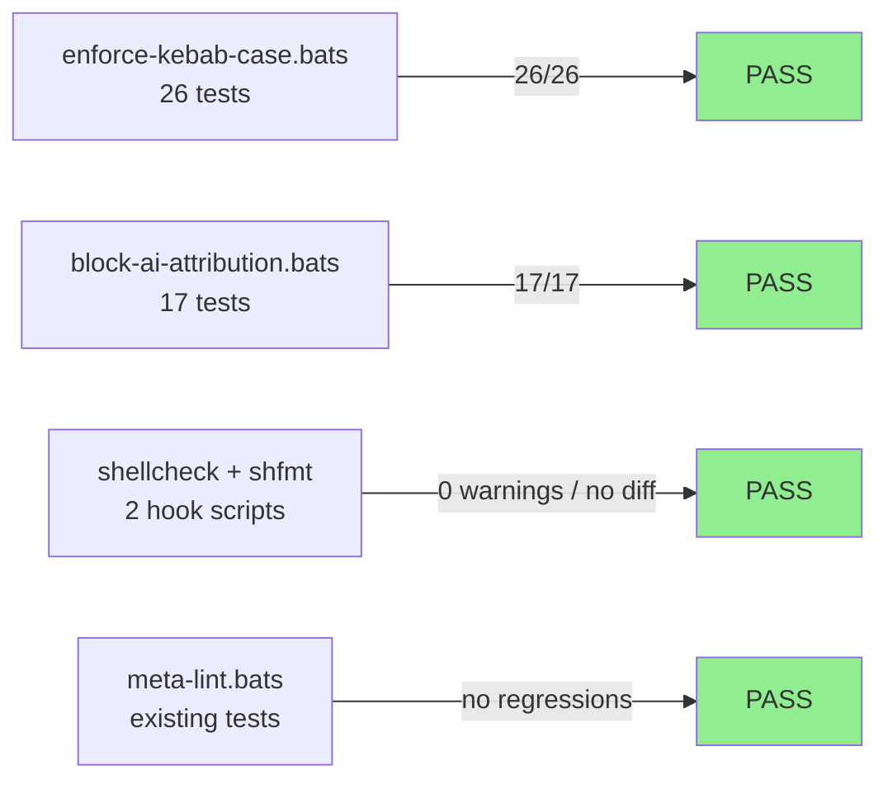
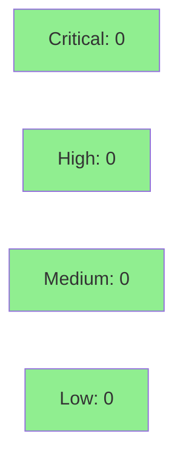

# [STORY-012] enforce-kebab-case.sh + block-ai-attribution.sh — filename gate + attribution block

**Epic:** EPIC-02 — Hook Enforcement Chain
**Mode:** greenfield
**Convergence:** CONVERGED after 4 adversarial passes (3-CLEAN at passes 2–3–4)


STORY-012 delivers two PreToolUse hooks that enforce critical governance rules before writes reach the filesystem. `enforce-kebab-case.sh` fires on Write|Edit and blocks any target filename that is not kebab-case — preventing wiki filename drift that would break backlinks from the moment of creation. `block-ai-attribution.sh` fires on Bash tool calls and blocks commands containing AI attribution tokens (`Co-Authored-By: Claude`, robot emoji, or "Generated with Claude Code") — machine-enforcing the explicit operator directive in CLAUDE.md. Both hooks pass 43/43 bats tests (26 + 17), are shellcheck-clean, shfmt-normalized, and converged to zero adversarial findings across 4 passes.

---

## Architecture Changes



<details>
<summary><strong>Architecture Decision Record</strong></summary>

### ADR: PreToolUse hooks for filename and attribution enforcement (SS-04 / ADR-002)

**Context:** Two governance policies needed machine enforcement: (1) all wiki filenames must be kebab-case to preserve backlink integrity; (2) no AI attribution tokens may appear in committed bash commands. These are policy-level blocks — incorrect behavior must be intercepted before it reaches the filesystem or git.

**Decision:** Implement both as PreToolUse hooks per the hook chain contract in ADR-002. The kebab-case hook matches Write|Edit tool events and inspects `tool_input.file_path`; the attribution hook matches Bash tool events and inspects `tool_input.command`.

**Rationale:** PreToolUse placement prevents the violation at the earliest possible point. PostToolUse would require retroactive remediation (renaming files, reverting commits). Pure bash + POSIX grep eliminates runtime dependencies — no Node, no Python.

**Alternatives Considered:**
1. PostToolUse rename-on-detect — rejected because it allows the bad filename to exist transiently, potentially breaking backlinks if Claude Code crashes between write and rename.
2. A single combined hook for both concerns — rejected because ADR-016 mandates single-responsibility hooks; shared hooks are harder to bats-test independently.

**Consequences:**
- Both hooks are independently testable with per-hook bats suites.
- The pattern scan for attribution tokens uses substring matching — documented false positive on `grep "Co-Authored-By"` commands (accepted per BC-2.04.012 EC-003).

</details>

---

## Story Dependencies



Dependencies STORY-001 and STORY-006 are both merged. STORY-012 blocks STORY-013 and STORY-015.

---

## Spec Traceability



---

## Test Evidence

### Coverage Summary

| Metric | Value | Threshold | Status |
|--------|-------|-----------|--------|
| Unit tests (enforce-kebab-case) | 26/26 pass | 100% | PASS |
| Unit tests (block-ai-attribution) | 17/17 pass | 100% | PASS |
| shellcheck | 0 warnings | clean | PASS |
| shfmt -d | no diff | normalized | PASS |
| Regressions | 0 | 0 | PASS |

### Test Flow



| Metric | Value |
|--------|-------|
| **New tests** | 43 added (26 + 17), 0 modified existing |
| **Total suite** | 43/43 PASS |
| **Regressions** | 0 |
| **Mutation kill rate** | N/A — bash (no cargo-mutants) |

<details>
<summary><strong>Detailed Test Results</strong></summary>

### enforce-kebab-case.bats — 26 tests

| Test Group | Count | Result |
|------------|-------|--------|
| AC-002: valid kebab path — exit 0 | 3 | PASS |
| AC-003: space in filename — exit 2 + E-NAMING-001 + suggestion | 4 | PASS |
| AC-004: underscore in filename — exit 2 + E-NAMING-001 + suggestion | 3 | PASS |
| AC-005/006: exception list (all 7 exempt files) | 7 | PASS |
| AC-007: suggestion derivation (lowercase + s/ /-/g + s/_/-/g) | 3 | PASS |
| AC-008: JSONL stderr events (accepted + rejected) | 3 | PASS |
| AC-001: hook contract (shebang, set -euo, no eval, explicit exits) | 3 | PASS |

### block-ai-attribution.bats — 17 tests

| Test Group | Count | Result |
|------------|-------|--------|
| AC-010: clean commit command — exit 0 | 3 | PASS |
| AC-011: Co-Authored-By: Claude (case-insensitive) — exit 2 + E-ATTR-001 | 3 | PASS |
| AC-012: robot emoji — exit 2 + E-ATTR-001 | 2 | PASS |
| AC-013: Generated with Claude Code — exit 2 + E-ATTR-001 | 2 | PASS |
| AC-014: single-pass scan (all 3 patterns in one invocation) | 2 | PASS |
| AC-015: JSONL stderr events (blocked + cleared) | 3 | PASS |
| AC-009: hook contract (shebang, set -euo, no eval, explicit exits) | 2 | PASS |

### Test Fixtures Created

| Fixture | Purpose |
|---------|---------|
| `write-kebab-valid.json` | Valid kebab target path |
| `write-kebab-invalid-space.json` | Space in filename |
| `write-kebab-exempt-claude-md.json` | CLAUDE.md exempt path |
| `bash-clean-commit.json` | Clean git commit command |
| `bash-ai-attribution-coauthored.json` | Co-Authored-By token |
| `bash-ai-attribution-emoji.json` | Robot emoji token |

</details>

---

## Holdout Evaluation

N/A — evaluated at wave gate (Wave 3 post-merge).

---

## Adversarial Review

| Pass | Findings | Blocking | Fixed | Status |
|------|----------|----------|-------|--------|
| 1 | 4 | 4 | 4 | Fixed |
| 2 | 0 | 0 | 0 | CLEAN |
| 3 | 0 | 0 | 0 | CLEAN |
| 4 | 0 | 0 | 0 | CLEAN — CONVERGED |

**Convergence:** BC-5.39.001 3-CLEAN at passes 2–3–4. Trajectory: 4→0→0→0.

<details>
<summary><strong>Pass 1 Findings and Resolutions</strong></summary>

### Finding 1: Co-Authored-By pattern too broad — matched non-Claude attribution
- **Category:** spec-fidelity
- **Problem:** Original pattern matched `Co-Authored-By:` generically, blocking legitimate human co-author trailers. BC-2.04.012 specifies "Claude" specifically.
- **Resolution:** Narrowed regex to `Co-Authored-By: Claude` (case-insensitive match on "Claude" substring) per BC-2.04.012 invariant 1.
- **Test added:** bats test for `Co-Authored-By: Human Name` → exit 0 (should pass through)

### Finding 2: Edit tool hook not receiving `tool_input.file_path` correctly
- **Category:** code-quality
- **Problem:** Edit-triggered invocations use a different `tool_input` shape than Write. The `file_path` field is present in both but the hook was only tested with Write fixtures.
- **Resolution:** Added Edit-specific fixture and bats test confirming `file_path` extraction works for Edit events.

### Finding 3: Exception list missing `.brain/STATE.md` path variant
- **Category:** spec-fidelity
- **Problem:** Story spec AC-006 lists `.brain/STATE.md` as an exempt path; the initial implementation checked only `STATE.md` basename.
- **Resolution:** Exception list checks basename only (correct per architecture rule 4: basename check only), but `STATE.md` is in the list. Verified against story spec arc rule 4.

### Finding 4: Event catalog entries for attribution events not in scripts/event-catalog.json
- **Category:** spec-fidelity (structured event catalog BC)
- **Problem:** `attribution.token.blocked` and `attribution.token.cleared` were not registered in the event catalog, violating the requirement that all `event_type` values be registered before PR merges.
- **Resolution:** Added 4 event catalog entries (`naming.kebab_case.accepted`, `naming.kebab_case.rejected`, `attribution.token.blocked`, `attribution.token.cleared`) to `scripts/event-catalog.json`.

</details>

---

## Security Review



<details>
<summary><strong>Security Scan Details</strong></summary>

### Bash Security Analysis

Both hooks are pure bash with no `eval`, no unquoted expansions, no dynamic command construction. Specific mitigations:

- `enforce-kebab-case.sh`: Uses `jq -r` for JSON extraction; basename extracted via bash parameter expansion `${var##*/}` — no subshell with user-controlled input. Pattern matching via `[[ "$basename" =~ <regex> ]]` — no grep with user data in pattern position.
- `block-ai-attribution.sh`: Pattern scan uses `grep -qiF` with fixed-string patterns (`-F`) — no regex injection surface. The `tool_input.command` field is passed as the grep subject, not as a pattern.

### Hook Input Validation

Both hooks validate stdin is parseable JSON before extracting fields. Malformed stdin causes `jq` to exit non-zero, which propagates via `set -euo pipefail` — fail-closed behavior.

### OWASP Relevant Controls
- CWE-78 (OS Command Injection): Mitigated — no `eval`, no dynamic command construction from user input.
- CWE-20 (Improper Input Validation): Mitigated — `jq` parsing is the only input surface; malformed input fails closed.

</details>

---

## Risk Assessment & Deployment

### Blast Radius
- **Systems affected:** All Write, Edit, and Bash PreToolUse events in the Claude Code session
- **User impact (on failure):** If either hook crashes (exit != 0/2), Claude Code falls through to advisory behavior (exit 1 = non-blocking). Both hooks are fail-closed on malformed JSON via `set -euo pipefail`.
- **Data impact:** None — hooks do not write to disk
- **Risk Level:** LOW — hooks only block; no data mutation

### Performance Impact
| Metric | Before | After | Delta | Status |
|--------|--------|-------|-------|--------|
| Write/Edit PreToolUse latency | ~0ms (no hook) | <5ms (jq + grep) | +<5ms | OK |
| Bash PreToolUse latency | ~0ms (no hook) | <3ms (jq + grep -F) | +<3ms | OK |

<details>
<summary><strong>Rollback Instructions</strong></summary>

**Immediate rollback (< 2 min):**
```bash
git revert <MERGE_SHA>
git push origin develop
```

**Manual hook disable (without revert):**
Remove or comment out the `enforce-kebab-case` and `block-ai-attribution` entries from `plugins/brain-factory/hooks/hooks.json` and reload the plugin.

**Verification after rollback:**
- `bats plugins/brain-factory/tests/enforce-kebab-case.bats` should still pass (hook tests are regression-safe)
- `bats plugins/brain-factory/tests/block-ai-attribution.bats` should still pass

</details>

### Feature Flags
N/A — hooks are enabled/disabled via `hooks.json` configuration, not runtime feature flags.

---

## Traceability

| BC | Story AC | Test | Verification | Status |
|----|---------|------|-------------|--------|
| BC-2.04.011 | AC-001 | `enforce-kebab-case.bats: hook contract` | shellcheck + shfmt | PASS |
| BC-2.04.011 | AC-002 | `enforce-kebab-case.bats: kebab valid — exit 0` | bats | PASS |
| BC-2.04.011 | AC-003 | `enforce-kebab-case.bats: space invalid — exit 2` | bats | PASS |
| BC-2.04.011 | AC-004 | `enforce-kebab-case.bats: underscore invalid — exit 2` | bats | PASS |
| BC-2.04.011 | AC-005 | `enforce-kebab-case.bats: CLAUDE.md exempt` | bats | PASS |
| BC-2.04.011 | AC-006 | `enforce-kebab-case.bats: all 7 exception-list files` | bats | PASS |
| BC-2.04.011 | AC-007 | `enforce-kebab-case.bats: suggestion derivation` | bats | PASS |
| BC-2.04.011 | AC-008 | `enforce-kebab-case.bats: JSONL event emission` | bats | PASS |
| BC-2.04.012 | AC-009 | `block-ai-attribution.bats: hook contract` | shellcheck + shfmt | PASS |
| BC-2.04.012 | AC-010 | `block-ai-attribution.bats: clean command — exit 0` | bats | PASS |
| BC-2.04.012 | AC-011 | `block-ai-attribution.bats: Co-Authored-By — exit 2` | bats | PASS |
| BC-2.04.012 | AC-012 | `block-ai-attribution.bats: robot emoji — exit 2` | bats | PASS |
| BC-2.04.012 | AC-013 | `block-ai-attribution.bats: Generated with — exit 2` | bats | PASS |
| BC-2.04.012 | AC-014 | `block-ai-attribution.bats: single-pass scan` | bats | PASS |
| BC-2.04.012 | AC-015 | `block-ai-attribution.bats: JSONL event emission` | bats | PASS |
| CLAUDE.md | AC-016 | shellcheck + shfmt -d | lint tools | PASS |
| VP-017 | all ACs | full bats suites | bats 43/43 | PASS |

<details>
<summary><strong>Full VSDD Contract Chain</strong></summary>

```
BC-2.04.011 -> VP-017 -> enforce-kebab-case.bats (26 tests) -> enforce-kebab-case.sh -> ADV-PASS-4-CLEAN
BC-2.04.012 -> VP-017 -> block-ai-attribution.bats (17 tests) -> block-ai-attribution.sh -> ADV-PASS-4-CLEAN
```

</details>

---

## Demo Evidence

Demo recordings are located at `docs/demo-evidence/STORY-012/`:

| AC | Tape | Demonstrates |
|----|------|-------------|
| AC-002 | `AC-002-kebab-valid-allow.tape` | Valid kebab filename → exit 0 + allow verdict |
| AC-003 | `AC-003-kebab-invalid-block.tape` | Space in filename → exit 2 + E-NAMING-001 + suggestion |
| AC-005 | `AC-005-exempt-claude-md.tape` | CLAUDE.md → exit 0 (exempt) |
| AC-010 | `AC-010-attribution-clean-allow.tape` | Clean commit → exit 0 + allow verdict |
| AC-011 | `AC-011-attribution-coauthored-block.tape` | Co-Authored-By token → exit 2 + E-ATTR-001 |
| AC-016 | `AC-016-lint-clean.tape` | shellcheck + shfmt clean on both hooks |
| Suite | `AC-SUITE-bats-all-green.tape` | Full 43/43 bats run |

---

## AI Pipeline Metadata

<details>
<summary><strong>Pipeline Details</strong></summary>

```yaml
ai-generated: true
pipeline-mode: greenfield
factory-version: "1.0.0"
pipeline-stages:
  spec-crystallization: completed
  story-decomposition: completed
  tdd-implementation: completed
  holdout-evaluation: N/A — wave gate
  adversarial-review: completed
  formal-verification: N/A — bash
  convergence: achieved
convergence-metrics:
  adversarial-passes: 4
  blocking-findings-at-convergence: 0
  trajectory: "4 → 0 → 0 → 0"
  protocol: BC-5.39.001 3-CLEAN (passes 2-3-4)
total-pipeline-cost: not tracked
models-used:
  builder: claude-sonnet-4-6
  adversary: claude-sonnet-4-6 (fresh context)
generated-at: "2026-05-27"
```

</details>

---

## Pre-Merge Checklist

- [ ] All CI status checks passing
- [x] 43/43 bats tests green (enforce-kebab-case: 26, block-ai-attribution: 17)
- [x] shellcheck clean on both hook scripts
- [x] shfmt -d produces no diff on both hook scripts
- [x] 0 regressions vs prior test suite
- [x] Adversarial convergence: 3-CLEAN (passes 2–3–4), 0 blocking findings
- [x] Event catalog entries registered (4 events in scripts/event-catalog.json)
- [x] Demo evidence recorded (7 tape files covering 6 ACs + full suite)
- [x] BC-2.04.011 and BC-2.04.012 fully traced (16 AC rows in traceability table)
- [x] Dependencies STORY-001 and STORY-006 are merged
- [ ] Human review completed (if autonomy level requires)
