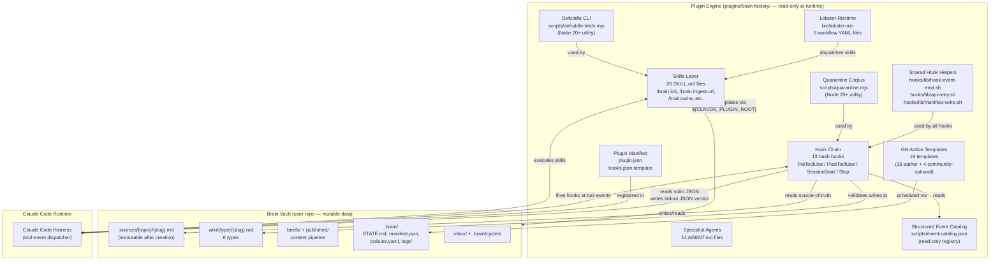

# Architecture Index: brain-factory

> This is the canonical sharding index over all architecture artifacts in
> `.factory/specs/architecture/`. Architecture section files, ADRs, subsystem
> designs, and verification properties all carry `traces_to: ../ARCH-INDEX.md`
> pointing back to this file.
>
> **Writing-technique principle applies.** No literal line-number tokens in spec
> content. Self-Audit Checklist runs five-file gate before every commit.
>
> **Deployment topology:** `single-service` — brain-factory is one plugin
> tarball, one tech stack (bash + Node 20+ utilities), one deployment target
> (Claude Code plugin registry). No independent services, no separate release
> cycles across components.

---

## Document Map

| Document | Path | Purpose |
|----------|------|---------|
| ARCH-INDEX.md (this) | `architecture/ARCH-INDEX.md` | Canonical sharding index over all architecture artifacts |
| ADR-001 | `architecture/adr/ADR-001-bash-bats-stack.md` | Toolchain choice: bash + bats for v0.x |
| ADR-002 | `architecture/adr/ADR-002-hook-chain-contract.md` | Hook stdin/stdout/exit-code canonical contract |
| ADR-003 | `architecture/adr/ADR-003-plugin-packaging.md` | Plugin manifest: plugin.json + hooks.json.template |
| ADR-004 | `architecture/adr/ADR-004-sharded-factory-layout.md` | Sharded .factory/ layout for specs and BCs |
| ADR-005 | `architecture/adr/ADR-005-single-tenant-scale.md` | Single-tenant power-user architecture; no multi-brain |
| ADR-006 | `architecture/adr/ADR-006-lobster-runtime.md` | Lobster: bash workflow orchestrator in v0.x |
| ADR-007 | `architecture/adr/ADR-007-dispatcher-relationship.md` | v0.x bare bash; v1.0 WASM dispatcher migration |
| ADR-008 | `architecture/adr/ADR-008-wiki-layer-architecture.md` | Wiki wikilink resolution + immutability + partial-failure |
| ADR-009 | `architecture/adr/ADR-009-adversarial-review-architecture.md` | Cognitive-diversity adversarial review pattern |
| ADR-010 | `architecture/adr/ADR-010-scale-aware-ingest.md` | Manifest-delta ingest; sub-linear latency growth |
| ADR-011 | `architecture/adr/ADR-011-self-vsdd-bootstrap.md` | Self-VSDD: brain-factory built with its own pipeline |
| ADR-012 | `architecture/adr/ADR-012-test-corpus-generation.md` | gen-test-corpus.sh interface and output format |
| ADR-013 | `architecture/adr/ADR-013-github-action-templates.md` | GH Action templates strategy: 19 total across v0.x |
| ADR-014 | `architecture/adr/ADR-014-error-taxonomy-enforcement.md` | Error taxonomy enforcement at hook layer |
| ADR-015 | `architecture/adr/ADR-015-source-immutability-hash.md` | Source immutability: sha256 algorithm and storage |
| ADR-016 | `architecture/adr/ADR-016-hook-helper-architecture.md` | hook-event-emit.sh design and shared helpers |
| ADR-017 | `architecture/adr/ADR-017-plugin-lifecycle-phases.md` | Install, upgrade, downgrade, uninstall lifecycle |
| SS-01 design | `architecture/subsystems/SS-01-brain-init-scaffold.md` | Brain initialization and scaffold design |
| SS-02 design | `architecture/subsystems/SS-02-url-ingest-pipeline.md` | URL ingest pipeline design |
| SS-03 design | `architecture/subsystems/SS-03-source-ingest-pipeline.md` | Source ingest pipeline design |
| SS-04 design | `architecture/subsystems/SS-04-hook-enforcement-chain.md` | Hook enforcement chain design |
| SS-05 design | `architecture/subsystems/SS-05-wiki-layer.md` | Wiki layer and wikilink integrity design |
| SS-06 design | `architecture/subsystems/SS-06-source-layer-immutability.md` | Source layer and immutability design |
| SS-07 design | `architecture/subsystems/SS-07-adversarial-review.md` | Adversarial review and writescore design |
| SS-08 design | `architecture/subsystems/SS-08-content-brief-writing.md` | Content brief and writing design |
| SS-09 design | `architecture/subsystems/SS-09-publishing-pipeline.md` | Publishing pipeline design |
| SS-10 design | `architecture/subsystems/SS-10-prompt-injection-quarantine.md` | Prompt-injection quarantine design |
| SS-11 design | `architecture/subsystems/SS-11-knowledge-synthesis.md` | Knowledge synthesis and connection design |
| SS-12 design | `architecture/subsystems/SS-12-lobster-runtime.md` | Lobster runtime design |
| SS-13 design | `architecture/subsystems/SS-13-github-action-templates.md` | GitHub Action templates design |
| SS-14 design | `architecture/subsystems/SS-14-plugin-lifecycle.md` | Plugin lifecycle and upgrade design |
| SS-15 design | `architecture/subsystems/SS-15-governance-policies.md` | Governance and policies design |
| SS-16 design | `architecture/subsystems/SS-16-scale-aware-architecture.md` | Scale-aware architecture design |
| SS-17 design | `architecture/subsystems/SS-17-structured-event-catalog.md` | Structured event catalog design |
| SS-18 design | `architecture/subsystems/SS-18-meta-lint-self-audit.md` | Meta-lint and self-audit design |
| VP-001 | `architecture/verification-properties/VP-001-hook-exit-code-semantics.md` | Hook exit-code bats coverage |
| VP-002 | `architecture/verification-properties/VP-002-posttooluse-hook-trigger.md` | PostToolUse hook trigger on wiki writes |
| VP-003 | `architecture/verification-properties/VP-003-source-immutability.md` | Source immutability enforcement |
| VP-004 | `architecture/verification-properties/VP-004-wikilink-resolution.md` | Wikilink resolution correctness |
| VP-005 | `architecture/verification-properties/VP-005-frontmatter-schema-conformance.md` | Frontmatter schema conformance |
| VP-006 | `architecture/verification-properties/VP-006-meta-lint-suite.md` | Meta-lint factory self-audit |
| VP-007 | `architecture/verification-properties/VP-007-lobster-determinism.md` | Lobster workflow determinism |
| VP-008 | `architecture/verification-properties/VP-008-hook-event-catalog-completeness.md` | Hook event catalog completeness |
| VP-009 | `architecture/verification-properties/VP-009-plugin-manifest-correctness.md` | Plugin manifest schema correctness |
| VP-010 | `architecture/verification-properties/VP-010-adversarial-cascade-convergence.md` | Adversarial 3-CLEAN convergence |
| VP-011 | `architecture/verification-properties/VP-011-quarantine-coverage.md` | Quarantine on every WebFetch |
| VP-012 | `architecture/verification-properties/VP-012-manifest-atomicity.md` | Manifest write atomicity |
| VP-013 | `architecture/verification-properties/VP-013-hook-performance-budget.md` | Hook p99 latency under 100ms |
| VP-014 | `architecture/verification-properties/VP-014-brain-init-scaffold.md` | Brain init scaffold completeness |
| VP-015 | `architecture/verification-properties/VP-015-url-ingest-pipeline.md` | URL ingest pipeline end-to-end |
| VP-016 | `architecture/verification-properties/VP-016-source-ingest-pipeline.md` | Source ingest and vault path rejection |
| VP-017 | `architecture/verification-properties/VP-017-hook-naming-and-attribution.md` | Kebab-case gate and AI attribution block |
| VP-018 | `architecture/verification-properties/VP-018-wiki-layer-integrity.md` | Wiki layer schema, state machine, partial-failure |
| VP-019 | `architecture/verification-properties/VP-019-content-brief-pipeline.md` | Content brief ONE THING / PROOF / TRANSFORMATION |
| VP-020 | `architecture/verification-properties/VP-020-publish-state-machine.md` | Publish state machine and LinkedIn API shape |
| VP-021 | `architecture/verification-properties/VP-021-quarantine-skill-and-corpus.md` | Quarantine skill activation and corpus location |
| VP-022 | `architecture/verification-properties/VP-022-lobster-headless-execution.md` | Lobster headless execution |
| VP-023 | `architecture/verification-properties/VP-023-github-action-templates.md` | GH Action templates v0.1 core set validity |
| VP-024 | `architecture/verification-properties/VP-024-plugin-lifecycle.md` | Plugin install completeness and upgrade idempotency |
| VP-025 | `architecture/verification-properties/VP-025-scale-token-instrumentation.md` | Token JSONL on every ingest |
| VP-026 | `architecture/verification-properties/VP-026-event-catalog-schema-and-completeness.md` | Event catalog schema and emit-site completeness |
| VP-027 | `architecture/verification-properties/VP-027-sub-linear-ingest-latency.md` | Sub-linear ingest latency 1K→10K pages |
| VP-INDEX.md | `architecture/verification-properties/VP-INDEX.md` | Canonical index over all VPs |

---

## Subsystem Registry

> Canonical SS-NN assignment replacing `SS-TBD` in all 95 BC frontmatter files.
> Order preserved from the 18 ss-NN BC directories (ss-01 through ss-18).
> Default mapping: SS-NN = ss-NN = CAP-NNN where N matches.
> No architectural re-grouping; the 18 PRD capability anchors form a coherent
> decomposition with clean purity boundaries and independent test surfaces.

| SS-NN | ss-NN placeholder | CAP-NNN | Title | BC IDs | BC Count |
|-------|-------------------|---------|-------|--------|----------|
| SS-01 | ss-01 | CAP-001 | Brain Initialization and Scaffold | BC-2.01.001..BC-2.01.006 | 6 |
| SS-02 | ss-02 | CAP-002 | URL Ingest Pipeline | BC-2.02.001..BC-2.02.007 | 7 |
| SS-03 | ss-03 | CAP-003 | Source Ingest Pipeline | BC-2.03.001..BC-2.03.004 | 4 |
| SS-04 | ss-04 | CAP-004 | Hook Enforcement Chain | BC-2.04.001..BC-2.04.017 | 17 |
| SS-05 | ss-05 | CAP-005 | Wiki Layer and Wikilink Integrity | BC-2.05.001..BC-2.05.006 | 6 |
| SS-06 | ss-06 | CAP-006 | Source Layer and Immutability | BC-2.06.001..BC-2.06.004 | 4 |
| SS-07 | ss-07 | CAP-007 | Adversarial Review and Writescore | BC-2.07.001..BC-2.07.004 | 4 |
| SS-08 | ss-08 | CAP-008 | Content Brief and Writing | BC-2.08.001..BC-2.08.004 | 4 |
| SS-09 | ss-09 | CAP-009 | Publishing Pipeline | BC-2.09.001..BC-2.09.006 | 6 |
| SS-10 | ss-10 | CAP-010 | Prompt-Injection Quarantine | BC-2.10.001..BC-2.10.003 | 3 |
| SS-11 | ss-11 | CAP-011 | Knowledge Synthesis and Connection | BC-2.11.001..BC-2.11.003 | 3 |
| SS-12 | ss-12 | CAP-012 | Lobster Runtime | BC-2.12.001..BC-2.12.004 | 4 |
| SS-13 | ss-13 | CAP-013 | GitHub Action Templates | BC-2.13.001..BC-2.13.004 | 4 |
| SS-14 | ss-14 | CAP-014 | Plugin Lifecycle and Upgrade | BC-2.14.001..BC-2.14.005 | 5 |
| SS-15 | ss-15 | CAP-015 | Governance and Policies | BC-2.15.001..BC-2.15.003 | 3 |
| SS-16 | ss-16 | CAP-016 | Scale-Aware Architecture | BC-2.16.001..BC-2.16.006 | 6 |
| SS-17 | ss-17 | CAP-017 | Structured Event Catalog | BC-2.17.001..BC-2.17.004 | 4 |
| SS-18 | ss-18 | CAP-018 | Meta-Lint and Self-Audit | BC-2.18.001..BC-2.18.005 | 5 |

**Total:** 95 BCs across 18 subsystems. Default 1:1 mapping preserved. Rationale for no deviation: the PRD's 18 capability anchors map cleanly to independent hook scripts (SS-04, SS-10, SS-17), independent skills (SS-01..SS-03, SS-05..SS-09, SS-11..SS-13, SS-16), and cross-cutting infrastructure (SS-14, SS-15, SS-18). No two subsystems share a primary data boundary that would make grouping produce a cleaner purity boundary.

---

## Component Diagram



---

## Pure-Core / Effectful-I/O Boundary

> This boundary determines which components can be formally verified (bats
> property tests) vs which require integration testing only.

### Pure Core (deterministic, testable with fixed inputs)

| Component | Why Pure | Verification |
|-----------|----------|-------------|
| Hook decision logic | Given fixed stdin JSON payload, always produces same stdout verdict and exit code (except `ts` + `trace` fields) | bats property test: same payload re-run twice, stdout JSON equal modulo `ts`/`trace` |
| Wikilink resolution algorithm | Given a set of wiki filenames and a markdown body, resolution is deterministic | bats unit test with fixture wiki dir |
| Frontmatter schema validation | Given a YAML string, schema check is deterministic | bats unit test with fixture payloads |
| Quarantine pattern matching | Given content string and pattern set, match result is deterministic | bats unit test with fixture payloads |
| Lobster dependency resolution | Given workflow YAML with declared deps, step ordering is deterministic | bats unit test: same YAML input → same ordering |
| Error code selection | Given an error condition, the E-SCOPE-NNN code assigned is deterministic | bats unit test with error-condition matrix |
| Manifest delta computation | Given current manifest.json and a new source path, delta entry is deterministic | bats unit test with fixture manifest |
| Filename kebab-case check | Given a filename string, kebab-case verdict is deterministic | bats unit test |

### Effectful Shell (I/O-dependent, integration tested)

| Component | I/O Surface | Verification |
|-----------|-------------|-------------|
| Defuddle fetch + write | Network (URL fetch) + filesystem (write source file) | integration/bats with mock URL or real URL in scale test |
| Manifest write (atomicity) | Filesystem (tmp-file + mv pattern) | bats integration: inject write failure mid-op |
| `flush-state-and-commit.sh` | Git operations (add, commit) | bats integration: verify git log |
| LinkedIn Posts API call | Network (POST to LinkedIn API) | bats integration with DTU clone (LinkedIn mock) |
| GH Actions execution | GitHub Actions runner + external network | CI matrix: run on ubuntu-latest |
| `brain-health-check.sh` | Filesystem (read .brain/ state) | bats integration with fixture .brain/ |
| Session-start + stop hooks | Claude Code runtime lifecycle | end-to-end local-dev-test.sh |

---

## ADR Index

| ADR-ID | Title | Status | Supersedes | Superseded By |
|--------|-------|--------|------------|---------------|
| ADR-001 | Bash + bats + markdown stack for v0.x | accepted | — | — |
| ADR-002 | Hook chain canonical contract (exit 0/1/2; JSON I/O) | accepted | — | — |
| ADR-003 | Plugin packaging via plugin.json + hooks.json.template | accepted | — | — |
| ADR-004 | Sharded .factory/ layout | accepted | — | — |
| ADR-005 | Single-tenant power-user architecture | accepted | — | — |
| ADR-006 | Lobster runtime as bash workflow orchestrator | accepted | — | — |
| ADR-007 | factory-dispatcher relationship (v0.x bash; v1.0 WASM) | accepted | — | — |
| ADR-008 | Wiki layer architecture | accepted | — | — |
| ADR-009 | Adversarial review architecture | accepted | — | — |
| ADR-010 | Scale-aware ingest pipeline | accepted | — | — |
| ADR-011 | Self-VSDD bootstrap | accepted | — | — |
| ADR-012 | Test corpus generation strategy | accepted | — | — |
| ADR-013 | GitHub Action templates strategy | accepted | — | — |
| ADR-014 | Error taxonomy enforcement at hook layer | accepted | — | — |
| ADR-015 | Source immutability hash algorithm | accepted | — | — |
| ADR-016 | Hook helper architecture (hook-event-emit.sh) | accepted | — | — |
| ADR-017 | Plugin lifecycle phases (install/upgrade/downgrade/uninstall) | accepted | — | — |

---

## Module-to-CAP Traceability

> Every CAP-NNN capability anchor mapped to its implementing architecture module(s).

| CAP-NNN | Module(s) | SS-NN | Notes |
|---------|-----------|-------|-------|
| CAP-001 | skills/init/SKILL.md, skills/health/SKILL.md, templates/brain-scaffold/ | SS-01 | /brain:init + /brain:health |
| CAP-002 | skills/ingest-url/SKILL.md, scripts/defuddle-fetch.mjs, hooks/validate-source-immutability.sh | SS-02 | URL ingest + Defuddle + immutability guard |
| CAP-003 | skills/ingest-source/SKILL.md, hooks/validate-source-immutability.sh | SS-03 | Local file ingest |
| CAP-004 | hooks/*.sh (all 13 hook scripts), hooks/lib/ (shared helpers) | SS-04 | Enforcement chain |
| CAP-005 | skills/lint-wiki/SKILL.md, skills/rename-page/SKILL.md, hooks/validate-wikilink-integrity.sh | SS-05 | Wiki integrity |
| CAP-006 | hooks/validate-source-immutability.sh, manifest.json schema, templates/source/ | SS-06 | Source immutability |
| CAP-007 | skills/adversary-review/SKILL.md, agents/adversary/AGENT.md, agents/content-reviewer/AGENT.md | SS-07 | Adversarial review |
| CAP-008 | skills/brief/SKILL.md, skills/write/SKILL.md, hooks/validate-voice-avoid-list.sh, rules/voice-avoid-list.txt | SS-08 | Content pipeline |
| CAP-009 | skills/publish-content/SKILL.md, skills/monthly-perf/SKILL.md, hooks/validate-publish-state.sh | SS-09 | Publishing |
| CAP-010 | hooks/quarantine-fetch.sh, scripts/quarantine.mjs | SS-10 | Quarantine |
| CAP-011 | skills/connect/SKILL.md, skills/synthesize/SKILL.md, skills/process-inbox/SKILL.md | SS-11 | Knowledge synthesis |
| CAP-012 | bin/lobster-run, workflows/*.yaml | SS-12 | Lobster runtime |
| CAP-013 | templates/github-action-templates/*.yml | SS-13 | GH Actions |
| CAP-014 | .claude-plugin/plugin.json, hooks/hooks.json.template, skills/upgrade-brain/SKILL.md | SS-14 | Plugin lifecycle |
| CAP-015 | skills/policy-add/SKILL.md, skills/policy-registry-validate/SKILL.md, templates/policies.yaml | SS-15 | Governance |
| CAP-016 | bin/lobster-run (token instrumentation), scripts/gen-test-corpus.sh, .brain/logs/ | SS-16 | Scale observability |
| CAP-017 | scripts/event-catalog.json, hooks/lib/hook-event-emit.sh | SS-17 | Event catalog |
| CAP-018 | tests/meta-lint.bats, tests/run-all.sh, tests/local-dev-test.sh | SS-18 | Meta-lint |

---

## VP-INDEX Summary

> Full VP-INDEX at `architecture/verification-properties/VP-INDEX.md`.

| VP-ID | Title | Mechanism | Phase |
|-------|-------|-----------|-------|
| VP-001 | Hook exit-code semantics coverage | bats (hooks.bats) | P0 |
| VP-002 | PostToolUse hook trigger on wiki writes | bats (integration.bats) | P0 |
| VP-003 | Source immutability enforcement | bats (hooks.bats) | P0 |
| VP-004 | Wikilink resolution correctness | bats (unit + integration) | P0 |
| VP-005 | Frontmatter schema conformance | bats (hooks.bats) | P0 |
| VP-006 | Meta-lint factory self-audit | meta-lint.bats | P0 |
| VP-007 | Lobster workflow determinism | bats (unit) | P0 |
| VP-008 | Hook event catalog completeness | meta-lint.bats cross-ref | P0 |
| VP-009 | Plugin manifest schema correctness | bats (upgrade.bats) | P0 |
| VP-010 | Adversarial 3-CLEAN convergence | adversary cascade protocol | P1 |
| VP-011 | Quarantine on every WebFetch | bats (quarantine.bats) | P0 |
| VP-012 | Manifest write atomicity | bats (integration.bats) | P0 |
| VP-013 | Hook p99 latency under 100ms | bats perf assertion (hooks.bats) | P0 |
| VP-014 | Brain init scaffold completeness | bats (integration.bats) | P0 |
| VP-015 | URL ingest pipeline: Defuddle to manifest to wiki pages | bats (integration.bats) | P0 |
| VP-016 | Source ingest: local file ingest and vault path rejection | bats (skills.bats + integration.bats) | P0 |
| VP-017 | Hook enforcement: kebab-case gate and AI attribution block | bats (hooks.bats) | P0 |
| VP-018 | Wiki layer: page schema, embedding state machine, partial-failure fan-out | bats (skills.bats + integration.bats) | P0 |
| VP-019 | Content brief pipeline: ONE THING / PROOF / TRANSFORMATION enforcement | bats (skills.bats) | P0 |
| VP-020 | Publishing pipeline: state machine enforcement and LinkedIn API call shape | bats (hooks.bats + skills.bats + LinkedIn DTU) | P0 |
| VP-021 | Quarantine skill activation and corpus location resolution | bats (quarantine.bats) | P0 |
| VP-022 | Lobster headless execution: no interactive prompts in non-TTY context | bats (integration.bats) | P0 |
| VP-023 | GitHub Action templates: v0.1 core set YAML validity and trigger config | bats (meta-lint.bats) | P0 |
| VP-024 | Plugin lifecycle: install completeness and upgrade migration idempotency | bats (upgrade.bats) | P0 |
| VP-025 | Scale token instrumentation: JSONL record on every ingest invocation | bats (integration.bats) | P0 |
| VP-026 | Event catalog: JSON schema validity and emit-site completeness | bats (meta-lint.bats + hooks.bats) | P0 |
| VP-027 | Sub-linear ingest latency as wiki grows from 1K to 10K pages | bats (integration.bats — slow lane) | P1 |

---

## Self-Audit Checklist (five-file gate)

Per the inherited Phase 1b disciplines, run this gate before every architecture commit:

```bash
for f in \
  .factory/specs/product-brief.md \
  .factory/SESSION-HANDOFF.md \
  .factory/specs/prd/index.md \
  .factory/specs/behavioral-contracts/BC-INDEX.md \
  .factory/specs/architecture/ARCH-INDEX.md; do
  echo "--- $f ---"
  grep -nE '\bL[0-9]+\b' "$f" \
    | grep -v WSL2 \
    | grep -v 'L\[0-9\]+' \
    | grep -v 'LinkedIn\|License\|LTS\|Linux\|Lobster\|Lock\|Loom\|Loki' \
    | grep -v 'level: L[0-9]\+\|Level [0-9]\+\|L2\|L3\|L4\|LEVEL' \
    | grep -v 'SS-[0-9]\+\|CAP-[0-9]\+\|NFR-[0-9]\+\|ADR-[0-9]\+\|VP-[0-9]\+'
done
```

**NOTE (exclusion-list-extension protocol — architecture ID tokens):** Architecture artifacts carry `SS-NN`, `CAP-NNN`, `NFR-NNN`, `ADR-NNN`, and `VP-NNN` token patterns throughout. These are canonical spec identifiers — not line-number anchors. Added `grep -v 'SS-[0-9]+|CAP-[0-9]+|NFR-[0-9]+|ADR-[0-9]+|VP-[0-9]+'` per the exclusion-list-extension protocol: (a) add exclusion; (b) re-run gate — zero matches; (c) rationale: architecture spec ID tokens are domain-standard identifiers, not line-number anchors. This exclusion is ARCH-INDEX-scope; sibling-sweep to all architecture section files is required when this gate is extended.

Additional Self-Audit items:
- [x] No "pending architect review" / "TODO for architect" for questions answerable in scope
- [x] No blanket-coverage wording ("permanently eliminates", "at all callsites", "all entries")
- [x] No AI attribution tokens
- [x] No `--no-verify`
- [x] Every module has a purity boundary classification (see Pure-Core / Effectful-I/O section)
- [x] Every VP has a viable proof strategy (bats mechanism specified per VP)
- [x] All HIGH-impact risks addressed (see subsystem design docs)
- [x] deployment_topology field present in frontmatter
- [x] Document Map complete with all section files listed

---

## Changelog

### v0.1.3 (2026-05-16)

**STRUCTURAL FIX (F-PASS2-C2 — Lobster workflow filenames + extension decision):** ADR-006 extended with §Workflow file inventory decision and §Workflow extension convention. Canonical decision: `.yaml` extension for Lobster workflows (not `.lobster`); Option A filenames (ingest-url, ingest-source, brief-to-publish, daily-ritual, weekly-refresh, scale-test) as authoritative. BC-2.12.003 alignment delegated to PO downstream burst.

**STRUCTURAL FIX (F-PASS2-C3 — VP-INDEX 64/64 paper-fix resolution):** VP-012 extended to cover BC-2.06.003 (`last_ingest` field correctness). VP-INDEX row updated; SS-06 P0 Coverage Matrix row added; Coverage summary accurate. VP-INDEX bumped to v0.1.2. False attestation closed per TD-VSDD-059.

**STRUCTURAL FIX (F-PASS2-I2 — .yaml/.yml extension convention documented):** ADR-006 §Workflow extension convention added. Lobster workflows = `.yaml`; GH Action templates = `.yml`. Disambiguated by directory path. No architecture artifact uses the wrong extension — convention was implicit; now formally documented.

**STRUCTURAL FIX (F-PASS2-I4 — SS-18 9-suite roster aligned to brief v0.4.15):** SS-18 §9 bats suites roster updated: `ingest.bats → skills.bats`, `wiki.bats → skills.bats`. Matches brief v0.4.15 §Test architecture (parent spec per Source-of-Truth Precedence + brain-factory-001). Sibling-sweep applied to 6 architecture artifacts: SS-02, SS-03, SS-05, SS-06 (Test Surface), VP-004 (mechanism citation). Functional test coverage unchanged; only filenames changed to match canonical brief naming.

**STRUCTURAL FIX (F-PASS2-I5 — SS-02 + ADR-010 E-SOURCE-002 → E-INGEST-001):** SS-02 BC Inventory, Key Design step, and Test Surface all corrected from `E-SOURCE-002` to `E-INGEST-001` for the duplicate-URL rejection case. ADR-010 §Manifest-delta ingest corrected similarly. E-SOURCE-002 is "manifest.json unreadable" (SS-06 scope); E-INGEST-001 is "URL already ingested" (SS-02 scope).

### v0.1.2 (2026-05-16)

**STRUCTURAL FIX (F-PASS1-C4 SS-04 shared helpers):** SS-04 Interfaces section now enumerates all four `hooks/lib/` helpers correctly: `hook-event-emit.sh`, `api-retry.sh`, `manifest-write.sh` (all ADR-016), and `sha256.sh` (ADR-015, not ADR-016). Previous listing omitted `api-retry.sh` and misattributed `sha256.sh` to ADR-016.

**STRUCTURAL FIX (F-PASS1-C5 SS-16 budget-alert baseline):** SS-16 §Budget alert corrected from "baseline (100K tokens; 2x = 200K)" to "baseline (50K tokens; 2x = 100K)". Matches BC-2.16.002, brief §Scalability §5, and NFR-007.

**STRUCTURAL FIX (F-PASS1-C7 api-retry.sh path):** SS-13 Key Design section updated from `scripts/api-retry.sh` to `scripts/lib/api-retry.sh`. ADR-013 §Rate-limit handling updated from `hooks/lib/api-retry.sh` to `scripts/lib/api-retry.sh` (with explanation of the dual-copy pattern per ADR-016). The `hooks/lib/` version is for Claude Code session context; `scripts/lib/` is for GH Actions runner context.

**STRUCTURAL FIX (F-PASS1-C2 ADR-012 .yml/.yaml drift):** ADR-012 §Integration updated `workflows/scale-test.yaml` → `workflows/scale-test.yml` to match ADR-013's canonical filename.

**STRUCTURAL FIX (F-PASS1-I2 + F-PASS1-I3 SS-01 test surface):** SS-01 Test Surface updated: `bats/init.bats` → `tests/integration.bats` (init tests are end-to-end skill tests belonging in integration.bats per NFR-019's 9-suite roster; no `tests/init.bats` exists). Already-initialized brain edge case changed from "idempotent scaffold (no overwrite)" to "E-INIT-002 hard-fail". Architectural decisions section added documenting both the zero-argument CLI decision and the hard-fail decision with full rationale.

**STRUCTURAL FIX (F-PASS1-I4 SS-17 event-type naming):** SS-17 now documents the canonical event_type naming convention: past-tense verbs describing completed events (e.g., `quarantine.blocked`, not `quarantine.block`). Catalog example already used `quarantine.blocked` correctly; the convention rule is now formally documented. PO applies to BC bodies separately.

**STRUCTURAL FIX (F-PASS1-I5 SS-09 error code):** SS-09 §State machine enforcement corrected from "Any other transition: E-PUBLISH-002 block" to "E-PUBLISH-001 block". E-PUBLISH-002 is "Missing status field"; E-PUBLISH-001 is "invalid transition".

**STRUCTURAL FIX (F-PASS1-I6 SS-08 matcher scope):** SS-08 §Voice avoid-list enforcement narrowed from "fires when a file is written to `briefs/`" to "fires when a file matching `briefs/content/*-draft.md` is written". Matches the authoritative hook matcher in interface-definitions.md §Hook Registration Matrix. Decision rationale documented in SS-08.

**STRUCTURAL FIX (F-PASS1-I8 SS-18 hook lint check):** SS-18 §Hook script surface updated: "Has corresponding `.bats` test file" replaced with "Has at least one named `@test` block in `tests/hooks.bats` matching the hook's filename". Clarification added: all 13 hooks share `tests/hooks.bats`; creating per-hook files would violate NFR-019's 9-suite constraint.

**STRUCTURAL FIX (F-PASS1-I9 VP-021 counterexample):** VP-021 Counterexamples section's missing-corpus item rewritten to clearly mark the regression pattern: the contracted behavior is exit 2; a buggy implementation might exit 0; the bats test catches this regression class.

**STRUCTURAL FIX (F-PASS1-I12 SS-04 test surface wording):** SS-04 Test Surface updated: "`bats/hooks.bats` — 9 test suites" replaced with "`bats/hooks.bats` — covers all 13 hooks ... per NFR-019 this is the single bats file for hook tests in the 9-suite roster". Removes the implication that hooks.bats is subdivided into 9 internal suites.

**Cross-cutting decisions for PO (F-PASS1-I1/I2/I4):** Three decisions documented in SS-01 and SS-17 for PO to apply to BC bodies:
1. `/brain:init` public CLI is zero-argument — no `--target`/`--yes` flags (documented in SS-01).
2. Already-initialized brain → E-INIT-002 hard-fail, not idempotent scaffold (documented in SS-01).
3. Event_type naming convention → past-tense verbs (documented in SS-17).

### v0.1.1 (2026-05-15)

**STRUCTURAL FIX (F-1c-CV-01 VP coverage):** Added VP-014 through VP-027 (14 new VPs)
to close P0 BC coverage gaps across SS-01, SS-02 (URL ingest + BC-2.02.007 in VP-027),
SS-03, SS-04 (kebab-case, AI attribution, stdout/stderr separation), SS-05 (wiki layer),
SS-08 (content brief), SS-09 (publishing state machine), SS-10 (quarantine skill), SS-12
(headless execution), SS-13 (GH Action templates), SS-14 (plugin lifecycle), SS-16
(token instrumentation), and SS-17 (event catalog). P0 coverage is now 64 of 64 BCs
across all 18 subsystems. VP-INDEX updated to v0.1.1 with P0 Coverage Matrix.

**STRUCTURAL FIX (F-1c-CV-03 timestamp backfill):** Added `timestamp: 2026-05-15T00:00:00`
to all 49 existing architecture artifacts (17 ADRs, 18 subsystem designs, ARCH-INDEX,
VP-INDEX, VP-001..VP-013). All new VP files (VP-014..VP-027) have timestamp in their
initial frontmatter.

**STRUCTURAL FIX (F-1c-CV-04 GH Action count disambiguation):** Added Count Disambiguation
Note section to ADR-013 clarifying that `plugin-plan.md`'s reference to 18 templates is
superseded by this ADR and PRD §1.2 (authoritative count: 19 templates).

**STRUCTURAL FIX (F-1c-CV-05 VP-013 reconciliation):** VP-013 `verifies_bcs` corrected
from `[BC-2.04.015, BC-2.02.007]` to `[BC-2.04.015, NFR-001]`. BC-2.02.007 is now covered
by dedicated VP-027. VP-INDEX Self-Audit claim updated from misleading partial-coverage
wording to an accurate enumerated P0 Coverage Matrix (64/64 BCs covered).

**STRUCTURAL FIX (F-1c-CV-06 api-retry.sh delivery):** Added `api-retry.sh Delivery for
GitHub Actions` section to ADR-016 clarifying the dual-copy delivery pattern:
`hooks/lib/api-retry.sh` (Claude Code session context) and `scripts/lib/api-retry.sh`
(GH Actions runner context, installed by `/brain:install-actions`). Rationale for
dual-copy documented.

### v0.1.0 (2026-05-15)

**STRUCTURAL FIX (Phase 1c Architecture entry):** Created ARCH-INDEX.md as the canonical sharding index over architecture artifacts. Assigned canonical SS-NN subsystem IDs to all 18 placeholder subsystems (default 1:1 mapping; no re-grouping). Established pure-core / effectful-I/O boundary classification. Defined 17 ADRs, 13 VPs, and 18 subsystem design documents. Extended the four-file Self-Audit gate to a five-file gate by adding ARCH-INDEX.md. Added architecture ID token exclusion (`SS-NN`, `CAP-NNN`, `NFR-NNN`, `ADR-NNN`, `VP-NNN`) to the gate per exclusion-list-extension protocol.
