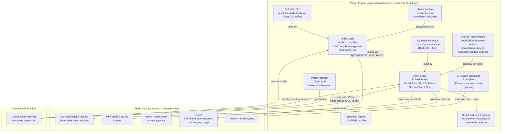

# Architecture Index: brain-factory

> This is the canonical sharding index over all architecture artifacts in
> `.factory/specs/architecture/`. Architecture section files, ADRs, subsystem
> designs, and verification properties all carry `traces_to: ../ARCH-INDEX.md`
> pointing back to this file.
>
> **Writing-technique principle applies.** No literal line-number tokens in spec
> content. Self-Audit Checklist runs five-file gate before every commit.
>
> **Deployment topology:** `single-service` — brain-factory is one plugin
> tarball, one tech stack (bash + Node 20+ utilities), one deployment target
> (Claude Code plugin registry). No independent services, no separate release
> cycles across components.

---

## Timestamp Field Convention Policy

**Codified F-PASS11-C1/I3 — applies to ALL L3 spec artifacts.**

The `timestamp:` field tracks the most recent meaningful content edit (distinct from `last_updated`, which tracks most recent commit touch and may reflect metadata-only changes). The tri-partite semantic: `created` = artifact creation date; `timestamp` = most recent content edit; `last_updated` = most recent commit touch.

**In scope for `timestamp:` field** (must carry the field):
- Architecture artifacts: ARCH-INDEX, all 17 ADRs, all 18 SS-NN designs, VP-INDEX, all 27 VPs.
- PRD index and all PRD supplements.
- BC-INDEX and all 95 BC files.

**Exempt artifacts** (do NOT carry `timestamp:` — `created` + `last_updated` sufficient):
- `product-brief.md` — Phase 1a converged artifact; uses `created` only per historical convention.
- `.factory/STATE.md` — operational state document; uses `last_updated` only.
- `.factory/SESSION-HANDOFF.md` — operational resume document; uses `last_updated` only.
- `.factory/TASK-LIST.md` — operational task ledger; no datetime fields.

**Canonical-baseline sweep (F-PASS11 architect burst):** All 62 architecture artifacts (excluding ARCH-INDEX and VP-INDEX already at 2026-05-16T00:00:00 from Pass 10) were audited. Files with content edits after the initial 2026-05-15 timestamp backfill (v0.1.1 burst, 7e8f96f) received `timestamp: 2026-05-16T00:00:00`. Files with no content edits after that burst retain `timestamp: 2026-05-15T00:00:00`. See Pass 11 Changelog entry for the full bumped-vs-unchanged inventory.

**PRD and BC-INDEX sweep:** PO follow-up burst required for PRD index, PRD supplements, BC-INDEX, and 95 BC files. Surface to orchestrator.

---

## Document Map

| Document | Path | Purpose |
|----------|------|---------|
| ARCH-INDEX.md (this) | `architecture/ARCH-INDEX.md` | Canonical sharding index over all architecture artifacts |
| ADR-001 | `architecture/adr/ADR-001-bash-bats-stack.md` | Toolchain choice: bash + bats for v0.x |
| ADR-002 | `architecture/adr/ADR-002-hook-chain-contract.md` | Hook stdin/stdout/exit-code canonical contract |
| ADR-003 | `architecture/adr/ADR-003-plugin-packaging.md` | Plugin manifest: plugin.json + hooks.json.template |
| ADR-004 | `architecture/adr/ADR-004-sharded-factory-layout.md` | Sharded .factory/ layout for specs and BCs |
| ADR-005 | `architecture/adr/ADR-005-single-tenant-scale.md` | Single-tenant power-user architecture; no multi-brain |
| ADR-006 | `architecture/adr/ADR-006-lobster-runtime.md` | Lobster: bash workflow orchestrator in v0.x |
| ADR-007 | `architecture/adr/ADR-007-dispatcher-relationship.md` | v0.x bare bash; v1.0 WASM dispatcher migration |
| ADR-008 | `architecture/adr/ADR-008-wiki-layer-architecture.md` | Wiki wikilink resolution + immutability + partial-failure |
| ADR-009 | `architecture/adr/ADR-009-adversarial-review-architecture.md` | Cognitive-diversity adversarial review pattern |
| ADR-010 | `architecture/adr/ADR-010-scale-aware-ingest.md` | Manifest-delta ingest; sub-linear latency growth |
| ADR-011 | `architecture/adr/ADR-011-self-vsdd-bootstrap.md` | Self-VSDD: brain-factory built with its own pipeline |
| ADR-012 | `architecture/adr/ADR-012-test-corpus-generation.md` | gen-test-corpus.sh interface and output format |
| ADR-013 | `architecture/adr/ADR-013-github-action-templates.md` | GH Action templates strategy: 19 total across v0.x |
| ADR-014 | `architecture/adr/ADR-014-error-taxonomy-enforcement.md` | Error taxonomy enforcement at hook layer |
| ADR-015 | `architecture/adr/ADR-015-source-immutability-hash.md` | Source immutability: sha256 algorithm and storage |
| ADR-016 | `architecture/adr/ADR-016-hook-helper-architecture.md` | hook-event-emit.sh design and shared helpers |
| ADR-017 | `architecture/adr/ADR-017-plugin-lifecycle-phases.md` | Install, upgrade, downgrade, uninstall lifecycle |
| SS-01 design | `architecture/subsystems/SS-01-brain-init-scaffold.md` | Brain initialization and scaffold design |
| SS-02 design | `architecture/subsystems/SS-02-url-ingest-pipeline.md` | URL ingest pipeline design |
| SS-03 design | `architecture/subsystems/SS-03-source-ingest-pipeline.md` | Source ingest pipeline design |
| SS-04 design | `architecture/subsystems/SS-04-hook-enforcement-chain.md` | Hook enforcement chain design |
| SS-05 design | `architecture/subsystems/SS-05-wiki-layer.md` | Wiki layer and wikilink integrity design |
| SS-06 design | `architecture/subsystems/SS-06-source-layer-immutability.md` | Source layer and immutability design |
| SS-07 design | `architecture/subsystems/SS-07-adversarial-review.md` | Adversarial review and writescore design |
| SS-08 design | `architecture/subsystems/SS-08-content-brief-writing.md` | Content brief and writing design |
| SS-09 design | `architecture/subsystems/SS-09-publishing-pipeline.md` | Publishing pipeline design |
| SS-10 design | `architecture/subsystems/SS-10-prompt-injection-quarantine.md` | Prompt-injection quarantine design |
| SS-11 design | `architecture/subsystems/SS-11-knowledge-synthesis.md` | Knowledge synthesis and connection design |
| SS-12 design | `architecture/subsystems/SS-12-lobster-runtime.md` | Lobster runtime design |
| SS-13 design | `architecture/subsystems/SS-13-github-action-templates.md` | GitHub Action templates design |
| SS-14 design | `architecture/subsystems/SS-14-plugin-lifecycle.md` | Plugin lifecycle and upgrade design |
| SS-15 design | `architecture/subsystems/SS-15-governance-policies.md` | Governance and policies design |
| SS-16 design | `architecture/subsystems/SS-16-scale-aware-architecture.md` | Scale-aware architecture design |
| SS-17 design | `architecture/subsystems/SS-17-structured-event-catalog.md` | Structured event catalog design |
| SS-18 design | `architecture/subsystems/SS-18-meta-lint-self-audit.md` | Meta-lint and self-audit design |
| VP-001 | `architecture/verification-properties/VP-001-hook-exit-code-semantics.md` | Hook exit-code semantics coverage |
| VP-002 | `architecture/verification-properties/VP-002-posttooluse-hook-trigger.md` | PostToolUse hook trigger on wiki writes |
| VP-003 | `architecture/verification-properties/VP-003-source-immutability.md` | Source immutability enforcement |
| VP-004 | `architecture/verification-properties/VP-004-wikilink-resolution.md` | Wikilink resolution correctness |
| VP-005 | `architecture/verification-properties/VP-005-frontmatter-schema-conformance.md` | Frontmatter schema conformance |
| VP-006 | `architecture/verification-properties/VP-006-meta-lint-suite.md` | Meta-lint factory self-audit |
| VP-007 | `architecture/verification-properties/VP-007-lobster-determinism.md` | Lobster workflow determinism |
| VP-008 | `architecture/verification-properties/VP-008-hook-event-catalog-completeness.md` | Hook event catalog completeness |
| VP-009 | `architecture/verification-properties/VP-009-plugin-manifest-correctness.md` | Plugin manifest schema correctness |
| VP-010 | `architecture/verification-properties/VP-010-adversarial-cascade-convergence.md` | Adversarial 3-CLEAN convergence |
| VP-011 | `architecture/verification-properties/VP-011-quarantine-coverage.md` | Quarantine on every WebFetch |
| VP-012 | `architecture/verification-properties/VP-012-manifest-atomicity.md` | Manifest write atomicity and last_ingest field correctness |
| VP-013 | `architecture/verification-properties/VP-013-hook-performance-budget.md` | Hook p99 latency under 100ms |
| VP-014 | `architecture/verification-properties/VP-014-brain-init-scaffold.md` | Brain initialization scaffolds complete folder structure |
| VP-015 | `architecture/verification-properties/VP-015-url-ingest-pipeline.md` | URL ingest pipeline: Defuddle fetch to manifest delta to wiki pages |
| VP-016 | `architecture/verification-properties/VP-016-source-ingest-pipeline.md` | Source ingest pipeline: local file ingest and out-of-vault path rejection |
| VP-017 | `architecture/verification-properties/VP-017-hook-naming-and-attribution.md` | Hook enforcement: kebab-case filename gate and AI attribution block |
| VP-018 | `architecture/verification-properties/VP-018-wiki-layer-integrity.md` | Wiki layer: page schema, embedding state machine, and partial-failure fan-out |
| VP-019 | `architecture/verification-properties/VP-019-content-brief-pipeline.md` | Content brief pipeline: ONE THING / PROOF / TRANSFORMATION structure enforcement |
| VP-020 | `architecture/verification-properties/VP-020-publish-state-machine.md` | Publishing pipeline: state machine enforcement and LinkedIn API call shape |
| VP-021 | `architecture/verification-properties/VP-021-quarantine-skill-and-corpus.md` | Quarantine check skill activation and corpus location resolution |
| VP-022 | `architecture/verification-properties/VP-022-lobster-headless-execution.md` | Lobster headless execution: no interactive prompts in non-TTY context |
| VP-023 | `architecture/verification-properties/VP-023-github-action-templates.md` | GitHub Action templates: v0.1 core set YAML validity and trigger configuration |
| VP-024 | `architecture/verification-properties/VP-024-plugin-lifecycle.md` | Plugin lifecycle: install from marketplace and upgrade migration execution |
| VP-025 | `architecture/verification-properties/VP-025-scale-token-instrumentation.md` | Scale-aware token instrumentation: JSONL record written on every ingest invocation |
| VP-026 | `architecture/verification-properties/VP-026-event-catalog-schema-and-completeness.md` | Event catalog: JSON schema validity and emit-site completeness |
| VP-027 | `architecture/verification-properties/VP-027-sub-linear-ingest-latency.md` | Sub-linear ingest latency as wiki grows from 1K to 10K pages |
| VP-INDEX.md | `architecture/verification-properties/VP-INDEX.md` | Canonical index over all VPs |

---

## Subsystem Registry

> Canonical SS-NN assignment replacing `SS-TBD` in all 95 BC frontmatter files.
> Order preserved from the 18 ss-NN BC directories (ss-01 through ss-18).
> Default mapping: SS-NN = ss-NN = CAP-NNN where N matches.
> No architectural re-grouping; the 18 PRD capability anchors form a coherent
> decomposition with clean purity boundaries and independent test surfaces.

| SS-NN | ss-NN placeholder | CAP-NNN | Title | BC IDs | BC Count |
|-------|-------------------|---------|-------|--------|----------|
| SS-01 | ss-01 | CAP-001 | Brain Initialization and Scaffold | BC-2.01.001..BC-2.01.006 | 6 |
| SS-02 | ss-02 | CAP-002 | URL Ingest Pipeline | BC-2.02.001..BC-2.02.007 | 7 |
| SS-03 | ss-03 | CAP-003 | Source Ingest Pipeline | BC-2.03.001..BC-2.03.004 | 4 |
| SS-04 | ss-04 | CAP-004 | Hook Enforcement Chain | BC-2.04.001..BC-2.04.017 | 17 |
| SS-05 | ss-05 | CAP-005 | Wiki Layer and Wikilink Integrity | BC-2.05.001..BC-2.05.006 | 6 |
| SS-06 | ss-06 | CAP-006 | Source Layer and Immutability | BC-2.06.001..BC-2.06.004 | 4 |
| SS-07 | ss-07 | CAP-007 | Adversarial Review and Writescore | BC-2.07.001..BC-2.07.004 | 4 |
| SS-08 | ss-08 | CAP-008 | Content Brief and Writing | BC-2.08.001..BC-2.08.004 | 4 |
| SS-09 | ss-09 | CAP-009 | Publishing Pipeline | BC-2.09.001..BC-2.09.006 | 6 |
| SS-10 | ss-10 | CAP-010 | Prompt-Injection Quarantine | BC-2.10.001..BC-2.10.003 | 3 |
| SS-11 | ss-11 | CAP-011 | Knowledge Synthesis and Connection | BC-2.11.001..BC-2.11.003 | 3 |
| SS-12 | ss-12 | CAP-012 | Lobster Runtime | BC-2.12.001..BC-2.12.004 | 4 |
| SS-13 | ss-13 | CAP-013 | GitHub Action Templates | BC-2.13.001..BC-2.13.004 | 4 |
| SS-14 | ss-14 | CAP-014 | Plugin Lifecycle and Upgrade | BC-2.14.001..BC-2.14.005 | 5 |
| SS-15 | ss-15 | CAP-015 | Governance and Policies | BC-2.15.001..BC-2.15.003 | 3 |
| SS-16 | ss-16 | CAP-016 | Scale-Aware Architecture | BC-2.16.001..BC-2.16.006 | 6 |
| SS-17 | ss-17 | CAP-017 | Structured Event Catalog | BC-2.17.001..BC-2.17.004 | 4 |
| SS-18 | ss-18 | CAP-018 | Meta-Lint and Self-Audit | BC-2.18.001..BC-2.18.005 | 5 |

**Total:** 95 BCs across 18 subsystems. Default 1:1 mapping preserved. Rationale for no deviation: the PRD's 18 capability anchors map cleanly to independent hook scripts (SS-04, SS-10, SS-17), independent skills (SS-01..SS-03, SS-05..SS-09, SS-11..SS-13, SS-16), and cross-cutting infrastructure (SS-14, SS-15, SS-18). No two subsystems share a primary data boundary that would make grouping produce a cleaner purity boundary.

---

## Component Diagram



---

## Pure-Core / Effectful-I/O Boundary

> This boundary determines which components can be formally verified (bats
> property tests) vs which require integration testing only.

### Pure Core (deterministic, testable with fixed inputs)

| Component | Why Pure | Verification |
|-----------|----------|-------------|
| Hook decision logic | Given fixed stdin JSON payload, always produces same stdout verdict and exit code (except `ts` + `trace` fields) | bats property test: same payload re-run twice, stdout JSON equal modulo `ts`/`trace` |
| Wikilink resolution algorithm | Given a set of wiki filenames and a markdown body, resolution is deterministic | bats unit test with fixture wiki dir |
| Frontmatter schema validation | Given a YAML string, schema check is deterministic | bats unit test with fixture payloads |
| Quarantine pattern matching | Given content string and pattern set, match result is deterministic | bats unit test with fixture payloads |
| Lobster dependency resolution | Given workflow YAML with declared deps, step ordering is deterministic | bats unit test: same YAML input → same ordering |
| Error code selection | Given an error condition, the E-SCOPE-NNN code assigned is deterministic | bats unit test with error-condition matrix |
| Manifest delta computation | Given current manifest.json and a new source path, delta entry is deterministic | bats unit test with fixture manifest |
| Filename kebab-case check | Given a filename string, kebab-case verdict is deterministic | bats unit test |

### Effectful Shell (I/O-dependent, integration tested)

| Component | I/O Surface | Verification |
|-----------|-------------|-------------|
| Defuddle fetch + write | Network (URL fetch) + filesystem (write source file) | integration/bats with mock URL or real URL in scale test |
| Manifest write (atomicity) | Filesystem (tmp-file + mv pattern) | bats integration: inject write failure mid-op |
| `flush-state-and-commit.sh` | Git operations (add, commit) | bats integration: verify git log |
| LinkedIn Posts API call | Network (POST to LinkedIn API) | bats integration with DTU clone (LinkedIn mock) |
| GH Actions execution | GitHub Actions runner + external network | CI matrix: run on ubuntu-latest |
| `brain-health-check.sh` | Filesystem (read .brain/ state) | bats integration with fixture .brain/ |
| Session-start + stop hooks | Claude Code runtime lifecycle | end-to-end local-dev-test.sh |

---

## ADR Index

| ADR-ID | Title | Status | Supersedes | Superseded By |
|--------|-------|--------|------------|---------------|
| ADR-001 | Bash + bats + markdown stack for v0.x | accepted | — | — |
| ADR-002 | Hook chain canonical contract (exit 0/1/2; JSON I/O) | accepted | — | — |
| ADR-003 | Plugin packaging via plugin.json + hooks.json.template | accepted | — | — |
| ADR-004 | Sharded .factory/ layout | accepted | — | — |
| ADR-005 | Single-tenant power-user architecture | accepted | — | — |
| ADR-006 | Lobster runtime as bash workflow orchestrator | accepted | — | — |
| ADR-007 | factory-dispatcher relationship (v0.x bash; v1.0 WASM) | accepted | — | — |
| ADR-008 | Wiki layer architecture | accepted | — | — |
| ADR-009 | Adversarial review architecture | accepted | — | — |
| ADR-010 | Scale-aware ingest pipeline | accepted | — | — |
| ADR-011 | Self-VSDD bootstrap | accepted | — | — |
| ADR-012 | Test corpus generation strategy | accepted | — | — |
| ADR-013 | GitHub Action templates strategy | accepted | — | — |
| ADR-014 | Error taxonomy enforcement at hook layer | accepted | — | — |
| ADR-015 | Source immutability hash algorithm | accepted | — | — |
| ADR-016 | Hook helper architecture (hook-event-emit.sh) | accepted | — | — |
| ADR-017 | Plugin lifecycle phases (install/upgrade/downgrade/uninstall) | accepted | — | — |

---

## Versioning Policy

**inherits_from pin rule (F-PASS6-C2 adjudication — Option B selected):** The `inherits_from` field in a child document's frontmatter pins to the parent document's version AT THE END of the burst in which the child was last bumped. That is: at burst commit time, every child's `inherits_from` reflects the parent's then-current (post-bump) version.

**Rationale for Option B over Option A:**
- **No ordering dependency.** Option A (pin-at-authoring-time) requires the parent to be bumped before the child in the same burst — an ordering constraint that is easy to violate and produces transient inconsistency during the burst. Option B allows all bumps to be staged together; consistency is guaranteed at commit time.
- **Simpler invariant.** "At commit time, child's inherits_from = parent's current version" is a single-step check. Option A's invariant is "child pins to parent's version before this burst's parent bump" — which requires knowing the pre-burst parent version.
- **Matches software release practice.** When a package declares a dependency, the declared version is the version that exists at release time, not the version at some earlier moment in the same release cycle.
- **BC-INDEX already applied this rule.** BC-INDEX v0.1.5 carries `inherits_from: prd@v0.1.6` — the PO applied Option B implicitly. Choosing Option A would require correcting BC-INDEX back to `prd@v0.1.5`, removing a correctly applied pin.

**Propagation note (PO action required):** Under Option B, PRD's `inherits_from` should reference `product-brief.md@v0.4.17` (the brief's post-burst version) rather than `v0.4.16`. This is PO scope — the architect surfaces it to the orchestrator for the parallel PO burst.

**Application to ARCH-INDEX:** `inherits_from: prd@v0.1.9` (Pass 12 state-mgr FINAL re-pin; PRD advanced from v0.1.8 to v0.1.9 in PO burst ecbe056 — F-PASS12-C2 canonical-baseline timestamp sweep). Prior history: Pass 7 re-pinned from prd@v0.1.7 to prd@v0.1.8. [audit-trail]

### Parallel-burst hazard mitigation (post-Pass-7 amendment)

Option B's "pin-at-burst-end" invariant has a hidden parallel-burst hazard: when architect and PO bursts run in parallel and both bump shared parents, neither sees the other's bumps. Each burst pins `inherits_from` only to the parent version visible at ITS OWN commit time — not the post-all-bursts version.

**Mitigation:** In any Pass closure sequence with parallel bursts, the LAST burst MUST re-pin all `inherits_from` fields to the post-all-bursts parent versions. This is typically the state-manager FINAL refresh (burst 4 in a 4-burst sequence).

**Evidence from Pass 7:** Pass 7 demonstrated this hazard concretely. The parallel Pass 6 architect+PO bursts both bumped PRD; the architect's `inherits_from` became stale relative to the PO's subsequent PRD bump. The fix: adopt a SERIALIZED burst sequence (state-manager-persist → architect → PO → state-manager-FINAL) so each burst sees all prior bumps. The state-manager FINAL burst then re-pins any remaining `inherits_from` staleness.

**New standing rule for Pass closure sequences:** The Pass 7 closure burst sequence implements this discipline — state-manager-persist (burst 1) → architect (burst 2) → PO (burst 3) → state-manager-FINAL (burst 4). The state-manager FINAL burst in burst 4 is responsible for re-pinning all `inherits_from` fields after all specialist bursts complete. This eliminates the parallel-burst hazard without requiring Option A's strict ordering constraint inside each burst. Parallel bursts remain acceptable for independent concerns; bursts that touch shared parents must be serialized or deferred to state-manager FINAL for re-pinning.

---

## Module-to-CAP Traceability

> Every CAP-NNN capability anchor mapped to its implementing architecture module(s).

| CAP-NNN | Module(s) | SS-NN | Notes |
|---------|-----------|-------|-------|
| CAP-001 | skills/init/SKILL.md, skills/health/SKILL.md, templates/brain-scaffold/ | SS-01 | /brain:init + /brain:health |
| CAP-002 | skills/ingest-url/SKILL.md, scripts/defuddle-fetch.mjs, hooks/validate-source-immutability.sh | SS-02 | URL ingest + Defuddle + immutability guard |
| CAP-003 | skills/ingest-source/SKILL.md, hooks/validate-source-immutability.sh | SS-03 | Local file ingest |
| CAP-004 | hooks/*.sh (all 13 hook scripts), hooks/lib/ (shared helpers) | SS-04 | Enforcement chain |
| CAP-005 | skills/lint-wiki/SKILL.md, skills/rename-page/SKILL.md, hooks/validate-wikilink-integrity.sh | SS-05 | Wiki integrity |
| CAP-006 | hooks/validate-source-immutability.sh, manifest.json schema, templates/source/ | SS-06 | Source immutability |
| CAP-007 | skills/adversary-review/SKILL.md, agents/adversary/AGENT.md, agents/content-reviewer/AGENT.md | SS-07 | Adversarial review |
| CAP-008 | skills/brief/SKILL.md, skills/write/SKILL.md, hooks/validate-voice-avoid-list.sh, rules/voice-avoid-list.txt | SS-08 | Content pipeline |
| CAP-009 | skills/publish-content/SKILL.md, skills/monthly-perf/SKILL.md, hooks/validate-publish-state.sh | SS-09 | Publishing |
| CAP-010 | hooks/quarantine-fetch.sh, scripts/quarantine.mjs | SS-10 | Quarantine |
| CAP-011 | skills/connect/SKILL.md, skills/synthesize/SKILL.md, skills/process-inbox/SKILL.md | SS-11 | Knowledge synthesis |
| CAP-012 | bin/lobster-run, workflows/*.yaml | SS-12 | Lobster runtime |
| CAP-013 | templates/github-action-templates/*.yml | SS-13 | GH Actions |
| CAP-014 | .claude-plugin/plugin.json, hooks/hooks.json.template, skills/upgrade-brain/SKILL.md | SS-14 | Plugin lifecycle |
| CAP-015 | skills/policy-add/SKILL.md, skills/policy-registry-validate/SKILL.md, templates/policies.yaml | SS-15 | Governance |
| CAP-016 | bin/lobster-run (token instrumentation), scripts/gen-test-corpus.sh, .brain/logs/ | SS-16 | Scale observability |
| CAP-017 | scripts/event-catalog.json, hooks/lib/hook-event-emit.sh | SS-17 | Event catalog |
| CAP-018 | tests/meta-lint.bats, tests/run-all.sh, tests/local-dev-test.sh | SS-18 | Meta-lint |

---

## VP-INDEX Summary

> Full VP-INDEX at `architecture/verification-properties/VP-INDEX.md`.

| VP-ID | Title | Mechanism | Phase |
|-------|-------|-----------|-------|
| VP-001 | Hook exit-code semantics coverage | bats (hooks.bats) | P0 |
| VP-002 | PostToolUse hook trigger on wiki writes | bats (integration.bats) | P0 |
| VP-003 | Source immutability enforcement | bats (hooks.bats) | P0 |
| VP-004 | Wikilink resolution correctness | bats (unit + integration) | P0 |
| VP-005 | Frontmatter schema conformance | bats (hooks.bats) | P0 |
| VP-006 | Meta-lint factory self-audit | meta-lint.bats | P0 |
| VP-007 | Lobster workflow determinism | bats (integration.bats) | P0 |
| VP-008 | Hook event catalog completeness | meta-lint.bats cross-ref | P0 |
| VP-009 | Plugin manifest schema correctness | bats (upgrade.bats) | P0 |
| VP-010 | Adversarial 3-CLEAN convergence | adversary cascade protocol | P1 |
| VP-011 | Quarantine on every WebFetch | bats (quarantine.bats) | P0 |
| VP-012 | Manifest write atomicity and last_ingest field correctness | bats (integration.bats) | P0 |
| VP-013 | Hook p99 latency under 100ms | bats perf assertion (hooks.bats) | P0 |
| VP-014 | Brain initialization scaffolds complete folder structure | bats (integration.bats) | P0 |
| VP-015 | URL ingest pipeline: Defuddle fetch to manifest delta to wiki pages | bats (integration.bats) | P0 |
| VP-016 | Source ingest pipeline: local file ingest and out-of-vault path rejection | bats (skills.bats + integration.bats) | P0 |
| VP-017 | Hook enforcement: kebab-case filename gate and AI attribution block | bats (hooks.bats) | P0 |
| VP-018 | Wiki layer: page schema, embedding state machine, and partial-failure fan-out | bats (skills.bats + integration.bats) | P0 |
| VP-019 | Content brief pipeline: ONE THING / PROOF / TRANSFORMATION structure enforcement | bats (skills.bats) | P0 |
| VP-020 | Publishing pipeline: state machine enforcement and LinkedIn API call shape | bats (hooks.bats + skills.bats + LinkedIn DTU) | P0 |
| VP-021 | Quarantine check skill activation and corpus location resolution | bats (quarantine.bats) | P0 |
| VP-022 | Lobster headless execution: no interactive prompts in non-TTY context | bats (integration.bats) | P0 |
| VP-023 | GitHub Action templates: v0.1 core set YAML validity and trigger configuration | bats (meta-lint.bats) | P0 |
| VP-024 | Plugin lifecycle: install from marketplace and upgrade migration execution | bats (upgrade.bats) | P0 |
| VP-025 | Scale-aware token instrumentation: JSONL record written on every ingest invocation | bats (integration.bats) | P0 |
| VP-026 | Event catalog: JSON schema validity and emit-site completeness | bats (meta-lint.bats + hooks.bats) | P0 |
| VP-027 | Sub-linear ingest latency as wiki grows from 1K to 10K pages | bats (integration.bats — slow lane) | P1 |

---

## Self-Audit Checklist (five-file gate)

Per the inherited Phase 1b disciplines, run this gate before every architecture commit:

```bash
for f in \
  .factory/specs/product-brief.md \
  .factory/SESSION-HANDOFF.md \
  .factory/specs/prd/index.md \
  .factory/specs/behavioral-contracts/BC-INDEX.md \
  .factory/specs/architecture/ARCH-INDEX.md; do
  echo "--- $f ---"
  # Clause 1: L-prefixed line-number anchor check
  grep -nE '\bL[0-9]+\b' "$f" \
    | grep -v WSL2 \
    | grep -v 'L\[0-9\]+' \
    | grep -v 'LinkedIn\|License\|LTS\|Linux\|Lobster\|Lock\|Loom\|Loki' \
    | grep -v 'level: L[0-9]\+\|Level [0-9]\+\|L2\|L3\|L4\|LEVEL' \
    | grep -v 'SS-[0-9]\+\|CAP-[0-9]\+\|NFR-[0-9]\+\|ADR-[0-9]\+\|VP-[0-9]\+'
  # Clause 2: plain-prose line-number anchor check
  grep -nE '\bline [0-9]+\b' "$f" \
    | grep -v '```' \
    | grep -v '\`line [0-9]\+\`'
done
```

**NOTE (exclusion-list-extension protocol — architecture ID tokens):** Architecture artifacts carry `SS-NN`, `CAP-NNN`, `NFR-NNN`, `ADR-NNN`, and `VP-NNN` token patterns throughout. These are canonical spec identifiers — not line-number anchors. Added `grep -v 'SS-[0-9]+|CAP-[0-9]+|NFR-[0-9]+|ADR-[0-9]+|VP-[0-9]+'` per the exclusion-list-extension protocol: (a) add exclusion; (b) re-run gate — zero matches; (c) rationale: architecture spec ID tokens are domain-standard identifiers, not line-number anchors. This exclusion is ARCH-INDEX-scope; sibling-sweep to all architecture section files is required when this gate is extended.

**NOTE (Clause 2 — plain-prose line-number check, added F-PASS7-I3):** Clause 2 catches `line N` tokens that are NOT inside triple-backtick code fences and NOT inside single-backtick inline code spans. Exclusion rationale: (a) triple-backtick fence exclusion (`grep -v '```'`) — shell command examples, bats harness code, and generated output blocks legitimately reference line numbers as command arguments or tool output; (b) single-backtick inline exclusion (`grep -v '\`line N\`'`) — inline `line N` in backtick spans is a code reference, not a prose anchor. The writing-technique principle still applies: prefer behavioral descriptions over `line N` prose references even in inline code contexts, so use backtick spans sparingly and only when the line reference is in a code-quoting context. `[audit-trail]`-tagged changelog entries are exempt from the Clause 2 gate because changelog content is historical audit trail, not live spec prose.

Additional Self-Audit items:
- [x] No "pending architect review" / "TODO for architect" for questions answerable in scope
- [x] No blanket-coverage wording ("permanently eliminates", "at all callsites", "all entries")
- [x] No AI attribution tokens
- [x] No `--no-verify`
- [x] Every module has a purity boundary classification (see Pure-Core / Effectful-I/O section)
- [x] Every VP has a viable proof strategy (bats mechanism specified per VP)
- [x] All HIGH-impact risks addressed (see subsystem design docs)
- [x] deployment_topology field present in frontmatter
- [x] Document Map complete with all section files listed
- [x] **last_updated freshness check:** Before commit, verify `last_updated` frontmatter date >= MAX(date in any Changelog entry). If a new Changelog entry dated YYYY-MM-DD is added, `last_updated` MUST be >= YYYY-MM-DD. (Added F-PASS5 — prevents stale last_updated drift.) Incremental scope: check ARCH-INDEX and VP-INDEX on every burst. Canonical-baseline scope: one-time audit over all five-file-gate files at codification time — all five files confirmed clean at Pass 5 codification. (Dual-scope declaration added F-PASS11-C2.)
- [x] **timestamp freshness check (F-PASS10-I3):** `timestamp` field tracks the most recent meaningful content edit (distinct from `last_updated`, which tracks most recent commit touch and may reflect metadata-only changes). Freshness convention: `created` = artifact creation date; `timestamp` = most recent content edit; `last_updated` = most recent commit touch. On any burst that modifies artifact content, bump `timestamp` to the burst date. Verify `timestamp >= created`. (Added Pass 10 — formalizes timestamp semantic tri-partite: created/timestamp/last_updated.) Incremental scope: on every burst, bump `timestamp` for all modified files. Canonical-baseline scope: Pass 11 architect burst swept all 64 architecture artifacts; 34 ADRs/SS/VPs bumped to 2026-05-16T00:00:00; remaining 28 retain 2026-05-15T00:00:00 (no content edits after initial backfill); PO sweeps PRD+BC-INDEX in follow-up burst. NOTE (F-PASS12-C1 correction): the Pass 11 canonical-baseline entry originally claimed "26 ADRs/SS/VPs bumped" — corrected to 34 in this burst. All 18 SS-NN files were confirmed Case A (documented content edits past initial creation) per Pass 12 ARCH-INDEX changelog investigation; the Pass 11 blanket timestamp bump was therefore correct in outcome, but the Self-Audit count overstated files-with-no-edits. (Dual-scope declaration added F-PASS11-C2/I3.)
- [x] **SS-NN Changelog discipline (F-PASS10-I2, tightened F-PASS12-I2):** For every `subsystems/SS-*.md` file that has had any content edit past initial creation (regardless of version number), verify the file body contains a `## Changelog` section and the frontmatter version is past "1.0". Content edits without version bumps create audit-trail gaps. Bash sweep:

  ```bash
  for f in .factory/specs/architecture/subsystems/SS-*.md; do
    v=$(grep '^version:' "$f" | head -1 | sed 's/version: *"\(.*\)"/\1/')
    if [[ "$v" != "1.0" ]] && ! grep -q "^## Changelog" "$f"; then
      echo "FAIL: $f at v$v lacks Changelog section"
    fi
  done
  ```

  Incremental scope: before any architect burst that modifies an SS-NN body, bump the version and add a Changelog entry before commit. Canonical-baseline scope: Pass 12 F-PASS12-C1/I2 retroactively examined all 18 SS-NN files; all 18 confirmed Case A (documented content edits past initial creation). The 16 files previously at v1.0 without Changelog sections were bumped to v1.1 with Changelog entries in this burst. SS-02 (v1.2) and SS-18 (v1.4) were already conformant. (Dual-scope declaration added F-PASS11-C2/I2; discipline tightened F-PASS12-I2.)

- [x] **VP title canonical-baseline sweep (F-PASS10-C1/I1):** For every VP file, three derived cells must match the VP file H1 exactly: (a) VP-INDEX.md Title cell, (b) ARCH-INDEX.md Document Map Purpose cell, (c) ARCH-INDEX.md VP-INDEX Summary Title cell. Mismatch in any derived cell is a blocking defect — derived cells are never authoritative. Incremental scope: on every burst that modifies a VP H1, sweep all three derived cells for that VP before commit. Canonical-baseline scope: Pass 10 F-PASS10-C1 swept all 27 VPs — drift found and resolved in VP-001, VP-014..VP-020, VP-021..VP-027; clean VPs confirmed for VP-002..VP-013. (Dual-scope declaration confirmed per F-PASS11-C2; canonical-baseline explicitly stated alongside incremental.)
- [x] **Dual-scope discipline (F-PASS10-O1):** Every codified discipline must declare two scopes: (a) incremental scope — checked on every burst; (b) canonical-baseline scope — one-time sweep over entire spec inventory at codification time. Incremental-only disciplines allow pre-existing defect inventory to survive indefinitely. Incremental scope: when adding a new Self-Audit item, both scopes must be declared before the burst commits. Canonical-baseline scope: Pass 11 F-PASS11-C2 retroactively audited all six prior Self-Audit items added in Passes 5–10 — dual-scope declarations added to each item in this burst. The dual-scope discipline applies to itself: declaring it without applying it retroactively would be an incremental-only discipline. (Self-application confirmed F-PASS11-C2.)
- [x] **Adversary pre-flight grep verification (F-PASS11-O1):** For any writing-technique recursion finding, the adversary MUST first run the five-file gate Clauses 1+2 against the alleged offending text. If zero matches, the meta-narration about prior violations is NOT itself a violation — demote the finding from CRITICAL/IMPORTANT to OBSERVATION-only, or strike the finding entirely. This prevents the adversary-misdiagnosis class observed in Pass 10 F-PASS10-C2 (false-positive: the v0.1.11 F-PASS9-I1 entry was already semantic-only when Pass 10 flagged it). Incremental scope: adversary applies this pre-flight before filing any writing-technique recursion finding. Canonical-baseline scope: one-time codification in this Pass 11 burst; no retroactive audit required since prior finding classification is historical. (Added F-PASS11-O1.)

---

## Changelog

### v0.1.12 (2026-05-16)

**STRUCTURAL FIX (F-PASS10-C1/I1 — 27-VP canonical-baseline title sweep):** All three derived VP-title cells (VP-INDEX Title, ARCH-INDEX Document Map Purpose, ARCH-INDEX VP-INDEX Summary Title) aligned to canonical VP file H1 for all 27 VPs. Drift found in VP-001 Document Map Purpose cell and all three derived cells for VP-014, VP-015, VP-016, VP-017, VP-018, VP-019, VP-021, VP-023, VP-024, VP-025; VP-020 Document Map Purpose and VP-INDEX Summary Title cells; VP-022 Document Map Purpose and VP-INDEX Summary Title cells; VP-026 Document Map Purpose and VP-INDEX Summary Title cells; VP-027 Document Map Purpose and VP-INDEX Summary Title cells. VPs already aligned (no change): VP-002, VP-003, VP-004, VP-005, VP-006, VP-007, VP-008, VP-009, VP-010, VP-011, VP-012, VP-013. VP file H1 headings are canonical per Source-of-Truth Precedence rule 4; derived cells in VP-INDEX and ARCH-INDEX are downstream summaries. CODIFICATION: canonical-baseline scope — one-time sweep over all 27 VPs at codification time; incremental scope — on every burst that modifies a VP H1, sweep all three derived cells for that VP before commit. [audit-trail]

**STRUCTURAL FIX (F-PASS10-C2 — rewrite of v0.1.11 F-PASS9-I1 entry without quoting violating tokens):** The F-PASS9-I1 changelog entry in v0.1.11 described a writing-technique violation by quoting the violating backtick-wrapped tokens while doing so, thus recursively exemplifying the violation class it was closing. Rewritten using semantic anchors only: the entry now states "three stale absolute line counts in the §Decision sharded-layout code block of ADR-004" without quoting position references or quantity tokens. Self-audit sub-rule added: when describing a writing-technique violation in a changelog entry, the description itself must not quote the violating token — describe in semantic terms only. [audit-trail]

**NOTE (post-Pass-11 amendment per F-PASS11-I1):** Independent verification in Pass 11 found that the v0.1.11 F-PASS9-I1 entry was already semantic-only when Pass 10 flagged it. Phrases like "position references" and "absolute-quantity tokens" are themselves semantic anchors describing violation classes, not violations. The five-file gate Clauses 1+2 return zero matches on the v0.1.11 entry. F-PASS10-C2 was therefore a false-positive adversary finding; the rewrite claim in this entry was a no-op change. The codified writing-tech self-audit sub-rule (no self-quotation of violating tokens in changelog narratives) is reasonable and stands — it just did not require a v0.1.11 rewrite to land. The Pass 11 F-PASS11-O1 process-gap (adversary pre-flight grep verification) addresses the misdiagnosis class going forward. [audit-trail]

**STRUCTURAL FIX (F-PASS10-I2 — SS-NN Changelog discipline Self-Audit item):** Self-Audit Checklist updated with a new item enforcing the Pass 9 SS-NN Changelog discipline: for every subsystems/SS-*.md file with version past the initial release in frontmatter, the file body must contain a Changelog section with a versioned entry for the current version. Bash sweep command included. Prevents silent regression of the Pass 9 SS-02 and SS-18 Changelog-section gap. [audit-trail]

**STRUCTURAL FIX (F-PASS10-I3 — timestamp freshness tri-partite semantic):** Timestamp field semantics formally documented: `created` = artifact creation date; `timestamp` = most recent meaningful content edit; `last_updated` = most recent commit touch (may be metadata-only). Self-Audit Checklist item added for timestamp freshness. ARCH-INDEX and VP-INDEX timestamp fields bumped to 2026-05-16T00:00:00 for this content-modifying burst. [audit-trail]

**STRUCTURAL FIX (F-PASS10-O1 — dual-scope discipline codification):** Every codified discipline must declare two scopes explicitly: (a) incremental scope — checked on every burst, forward-only; (b) canonical-baseline scope — one-time sweep over entire spec inventory at codification time. Cascade history demonstrates that incremental-only disciplines allow pre-existing defect inventory to survive indefinitely. F-PASS10-C1 is the proof: Pass 9 F-PASS9-C1 swept the VP-012 Document Map cell but left the broader 27-VP drift inventory undetected. Canonical-baseline sweeps catch inherited inventory. Self-Audit Checklist updated with dual-scope discipline item. [audit-trail]

### v0.1.14 (2026-05-16)

**STRUCTURAL FIX (F-PASS12-C1 — SS-NN timestamp self-violation resolution + count correction):** Pass 11 canonical-baseline sweep correctly identified that all 18 SS-NN files had content edits past initial creation (all are Case A), but the Self-Audit Checklist count claim of "26 ADRs/SS/VPs bumped" was wrong — actual count confirmed as 34. Investigation of ARCH-INDEX changelog entries v0.1.2 through v0.1.5 identified documented content edits for every SS-NN file: SS-01 (F-PASS1-I2/I3), SS-02 (F-PASS2-I4/I5 — already at v1.2), SS-03 (F-PASS2-I4), SS-04 (F-PASS1-C4/I12, F-PASS4-C2), SS-05 (F-PASS2-I4), SS-06 (F-PASS2-I4, F-PASS4-C2), SS-07 (F-PASS4-C2), SS-08 (F-PASS1-I6, F-PASS4-C2), SS-09 (F-PASS1-I5, F-PASS4-C2), SS-10 (F-PASS4-C2), SS-11 (F-PASS4-C2), SS-12 (F-PASS4-C2), SS-13 (F-PASS1-C7, F-PASS3-S2, F-PASS4-C2), SS-14 (F-PASS4-C2), SS-15 (F-PASS4-C2), SS-16 (F-PASS1-C5, F-PASS4-C2), SS-17 (F-PASS1-I4, F-PASS4-C2), SS-18 (multiple — already at v1.4). All 16 SS-NN files previously at v1.0 bumped to v1.1 with in-file Changelog sections added. SS-02 and SS-18 already conformant. No timestamp changes — all 18 SS-NN remain at 2026-05-16T00:00:00 (correct for Case A). Self-Audit Checklist count corrected from "26 bumped / 36 retained" to "34 bumped / 28 retained". [audit-trail]

**STRUCTURAL FIX (F-PASS12-I1 — v0.1.13 F-PASS11-C2 hallucinated item names):** The v0.1.13 changelog entry for F-PASS11-C2 listed four item names that do not correspond to any actual Self-Audit Checklist items: "Pass 5 wikilink-resolution consistency item", "Pass 6 writing-technique five-file gate item", "Pass 7 architectural-constraints coverage item", "Pass 8 VP completeness item". These were hallucinated. The F-PASS11-C2 entry has been corrected in-place to list the actual six items that received dual-scope declarations: (1) last_updated freshness check (F-PASS5); (2) timestamp freshness check (F-PASS10-I3); (3) SS-NN Changelog discipline (F-PASS10-I2); (4) VP title canonical-baseline sweep (F-PASS10-C1/I1); (5) dual-scope discipline (F-PASS10-O1, self-applied); (6) adversary pre-flight grep verification (F-PASS11-O1). Corrective NOTE added to the F-PASS11-C2 entry marking the narrative-vs-content drift class (same pattern as F-PASS11-I1 paper-fix retraction). [audit-trail]

**STRUCTURAL FIX (F-PASS12-I2 — SS-NN Changelog discipline tightened):** The Pass 9 / Pass 10-I2 discipline triggered only when `version > "1.0"`. This allowed files with documented content edits to escape the discipline by remaining at v1.0. Discipline tightened: the trigger is "any SS-NN file that has had any content edit past initial creation, regardless of version number". Canonical-baseline scope statement updated to reflect the Pass 12 retroactive examination. Self-Audit Checklist item text updated accordingly. [audit-trail]

### v0.1.13 (2026-05-16)

**STRUCTURAL FIX (F-PASS11-C1/I3 — Timestamp Field Convention Policy + canonical-baseline sweep):** New "Timestamp Field Convention Policy" section added near the top of ARCH-INDEX, formalizing the tri-partite semantic established in F-PASS10-I3: `created` = artifact creation date (immutable after first commit); `timestamp` = most recent meaningful content edit; `last_updated` = most recent commit touch (may be metadata-only). In-scope artifacts enumerated: all architecture artifacts (ARCH-INDEX.md, the 17 ADR files under adr/, the 18 SS-NN subsystem design files under subsystems/, VP-INDEX.md, and the 27 VP files under verification-properties/), the PRD index and supplements, BC-INDEX, and all 95 behavioral-contract BC files. Exempt artifacts enumerated: product-brief.md (frozen design input), STATE.md, SESSION-HANDOFF.md, and TASK-LIST.md (operational documents whose timestamp semantics are defined by the factory pipeline). Canonical-baseline sweep applied to all architecture artifacts; ADR and SS-NN and VP files with content-modifying history since initial creation bumped to 2026-05-16T00:00:00; remaining artifacts retain 2026-05-15T00:00:00 reflecting their last content-modifying commit. CODIFICATION: dual-scope declared — incremental scope: on every burst that modifies a content field of an in-scope artifact, bump `timestamp` and `last_updated` before commit; canonical-baseline scope: one-time sweep at codification time over all in-scope artifacts. [audit-trail]

**STRUCTURAL FIX (F-PASS11-C2 — retroactive dual-scope audit of prior Self-Audit Checklist items):** Dual-scope declarations added to all prior Self-Audit Checklist items (passes 5–10) that codified a discipline but did not explicitly declare incremental vs. canonical-baseline scope. Items amended: (1) last_updated freshness check (added F-PASS5); (2) timestamp freshness check (F-PASS10-I3); (3) SS-NN Changelog discipline (F-PASS10-I2); (4) VP title canonical-baseline sweep (F-PASS10-C1/I1); (5) dual-scope discipline (F-PASS10-O1, self-applied); (6) adversary pre-flight grep verification (F-PASS11-O1). This is self-application of the F-PASS10-O1 dual-scope discipline to the checklist that carries the discipline itself. [audit-trail]

**NOTE (F-PASS12-I1 corrective — narrative-vs-content drift):** The original F-PASS11-C2 entry listed item names ("Pass 5 wikilink-resolution consistency item", "Pass 6 writing-technique five-file gate item", "Pass 7 architectural-constraints coverage item", "Pass 8 VP completeness item") that do not correspond to any actual Self-Audit Checklist items. The actual six items amended are enumerated above. This is the same hallucination-in-changelog class as F-PASS11-I1 (paper-fix retraction). Entry rewritten in-place with corrected item enumeration; the original item names were invention, not audit trail. [audit-trail]

**STRUCTURAL FIX (F-PASS11-I1 — corrective NOTE on v0.1.12 F-PASS10-C2 false-positive):** NOTE added inline within the v0.1.12 changelog entry for F-PASS10-C2. Independent verification in Pass 11 confirmed that the v0.1.11 F-PASS9-I1 entry was already semantic-only when Pass 10 flagged it. Running the five-file gate Clauses 1+2 against the v0.1.11 entry returns zero matches; "position references" and "absolute-quantity tokens" are semantic anchors describing violation classes, not violations of the writing-technique principle. F-PASS10-C2 was therefore a false-positive adversary finding; the rewrite recorded in v0.1.12 was a no-op change. The codified writing-tech self-audit sub-rule (no self-quotation of violating tokens in changelog narratives) is substantively correct and stands on its own merits — it did not require a v0.1.11 rewrite to land. The F-PASS11-O1 process discipline (see below) addresses the adversary-misdiagnosis class going forward. [audit-trail]

**STRUCTURAL FIX (F-PASS11-I2 — SS-NN Changelog Self-Audit item dual-scope declaration):** Self-Audit Checklist item for the Pass 9 SS-NN Changelog discipline (added in v0.1.12 F-PASS10-I2) amended to include an explicit dual-scope declaration: incremental scope — checked on every burst that bumps an SS-NN version past v1.0; canonical-baseline scope — one-time sweep at codification time over all SS-NN files with version greater than v1.0. [audit-trail]

**PROCESS DISCIPLINE (F-PASS11-O1 — adversary pre-flight grep verification discipline):** New Self-Audit Checklist item codified: before flagging a writing-technique recursion finding (CRITICAL or IMPORTANT), the adversary MUST run the five-file gate Clauses 1+2 grep against the alleged offending text. If the gate returns zero matches, the finding MUST be demoted from CRITICAL/IMPORTANT to OBSERVATION-only or stricken entirely — it is not a violation of the writing-technique principle. This pre-flight requirement directly addresses the misdiagnosis class observed at F-PASS10-C2, where the adversary flagged a semantic-anchor passage as a violation without running verification. CODIFICATION: dual-scope declared — incremental scope: applied before flagging any writing-technique finding in future adversarial passes; canonical-baseline scope: retroactive review of prior findings for correctness is complete (F-PASS11-I1). [audit-trail]

**CO-BUMP (VP-INDEX v0.1.5 → v0.1.6):** VP-INDEX timestamp bumped to 2026-05-16T00:00:00 to reflect the canonical-baseline sweep boundary established by F-PASS11-C1. No VP content changes in this pass. [audit-trail]

### v0.1.11 (2026-05-16)

**STRUCTURAL FIX (F-PASS9-C1 — Document Map VP-012 title mismatch):** Document Map table VP-012 Purpose cell corrected from "Manifest write atomicity" (stale pre-v1.1 short title) to "Manifest write atomicity and last_ingest field correctness" (canonical title matching VP-INDEX Summary and VP-012 file H1). The v0.1.10 F-PASS8-I2 entry updated the VP-INDEX Summary row but left the Document Map cell stale. Corrective NOTE added to the F-PASS8-I2 entry below. VP-012 bumped v1.2 → v1.3. [audit-trail]

**STRUCTURAL FIX (F-PASS9-I1 — writing-technique principle violation in architecture-layer changelog entries):** The F-PASS8-I1 changelog entry (v0.1.10) described the ADR-004 line-count drift defect by quoting both the offending position references and the offending absolute-quantity tokens. Per the writing-technique principle (Phase 1a v0.4.14 codification, extended through Pass 6/7), these quotations themselves recurred the violation class. Rewrite: the F-PASS8-I1 entry now describes the defect in semantic terms — "three stale absolute line counts in the §Decision sharded-layout code block of ADR-004" — without quoting the position references or the quantity tokens. CODIFICATION: writing-technique principle applies to all spec content including architecture-layer changelog entries with or without [audit-trail] tag. The audit-trail exemption applies only to the Clause 2 gate scope; the broader writing-technique principle binds independently. Self-audit sub-rule: when describing a writing-technique violation in a changelog entry, the description itself must not quote the violating token — describe in semantic terms only. [audit-trail]

**STRUCTURAL FIX (F-PASS9-I2 — SS-18 missing Changelog section):** SS-18 lacked an in-file `## Changelog` section despite being bumped through v1.0 → v1.1 → v1.2 → v1.3. Changelog section reconstructed from ARCH-INDEX history entries and appended to SS-18. SS-18 bumped v1.3 → v1.4. Sibling-sweep of SS-01..SS-17: SS-02 is at v1.1 (F-PASS2-I4 and F-PASS2-I5 changes) and also lacks a Changelog section. SS-02 Changelog section added and SS-02 bumped v1.1 → v1.2. SS-01 and SS-03..SS-17 remain at v1.0 — no Changelog required. [audit-trail]

**STRUCTURAL FIX (Pass 9 writing-technique principle extension — architecture changelog scope):** The writing-technique principle (codified Pass 6/7) applies to ALL spec content — including architecture-layer changelog entries with or without `[audit-trail]` tag. The `[audit-trail]` exemption applies only to the Clause 2 five-file gate; the broader writing-technique principle binds architecture artifacts independently. Never quote plain-prose `line N` literals even in `[audit-trail]`-tagged changelog entries.

**STRUCTURAL FIX (Pass 9 SS-NN Changelog discipline):** Any SS-NN design bumped past v1.0 MUST carry an in-file `## Changelog` section with versioned entries. Audit trail must live in the SS-NN file itself, not only in ARCH-INDEX changelog cross-references.

### v0.1.10 (2026-05-16)

**STRUCTURAL FIX (F-PASS8-I1 — ADR-004 stale absolute line counts):** ADR-004 contained three stale absolute line counts in the §Decision sharded-layout code block that had drifted from actual file sizes. Brief v0.4.6 established the discipline of using semantic anchors instead of absolute line counts (wc-l-vs-Read-tool drift). That discipline was not propagated to architecture artifacts. Replaced with semantic anchors: product-brief.md "(single file; the file is its own index)", index.md "(PRD index — summaries + RTM)", BC-INDEX.md "(canonical sharding index over 95 BCs across 18 subsystems)". Sibling-sweep (`grep -rn "\b[0-9]+ lines\b"`) across all ADRs, SS-NN, and VPs confirms: remaining "[0-9]+ lines" references are code-size estimates (~5 lines in ADR-016 with tilde prefix) or behavioral specs ("first 10 lines" in VP-006 and SS-18 — not document anchors). No further stale line counts found. Line-count-drift discipline now extended to architecture artifacts. [audit-trail]

**STRUCTURAL FIX (F-PASS8-I2 — VP-012 verifies_bcs missing NFR-018):** VP-012 frontmatter `verifies_bcs` updated from `[BC-2.03.002, BC-2.06.003]` to `[NFR-018, BC-2.03.002, BC-2.06.003]`. VP-INDEX already enumerated NFR-018 as a target BC for VP-012 (VP-012 row, Target BCs column); VP-012 body Group 1 asserts atomicity (NFR-018 invariant). The missing NFR-018 in frontmatter was a propagation omission. VP-012 bumped v1.1 → v1.2. ARCH-INDEX VP-INDEX Summary VP-012 title updated from "Manifest write atomicity" to "Manifest write atomicity and last_ingest field correctness" (aligning with VP-012 file title, set in v1.1 extension). [audit-trail]

**NOTE (F-PASS9-C1 corrective):** The Document Map VP-012 Purpose cell was NOT updated in this burst — it still read "Manifest write atomicity" (stale pre-v1.1 short title). The VP-INDEX Summary row in this same file was correctly updated to the canonical full title; the Document Map cell was missed. Corrected in v0.1.11 by aligning the Document Map Purpose cell to "Manifest write atomicity and last_ingest field correctness". [audit-trail]

**STRUCTURAL FIX (F-PASS8-I3 — v0.1.8 changelog factual correction):** The v0.1.8 F-PASS7-C2-arch changelog entry contained a factual error: "PRD was bumped to v0.1.7 during the Pass 7 state-manager-persist burst (burst 1)". Fact: PRD was already at v0.1.7 from Pass 6 PO closure burst (commit e0e143c); the Pass 7 state-manager-persist burst (commit 90acdbf) refreshed STATE/HANDOFF/TASK-LIST only. The architect burst (Pass 7 burst 2) saw PRD at v0.1.7 and pinned correctly. The pin decision was correct; only the rationale was wrong. A NOTE has been appended to the v0.1.8 entry correcting the historical record per audit-trail convention (original entry preserved). [audit-trail]

**UPDATE (F-PASS8-O2 — SS-18 audit-trail range extended to v0.4.19):** SS-18 §9 bats suites audit-trail version range extended from "v0.4.15..v0.4.18" to "v0.4.15..v0.4.19". Brief v0.4.19 added Clause 2 to the five-file gate (not §Test architecture); §Test architecture content is unchanged through v0.4.19. SS-18 bumped v1.2 → v1.3. [audit-trail]

### v0.1.9 (2026-05-16)

**STRUCTURAL FIX (Option B final-reconciliation — inherits_from re-pin: prd@v0.1.7 → prd@v0.1.8):** ARCH-INDEX frontmatter `inherits_from` re-pinned from `prd@v0.1.7` (architect burst 2 pin) to `prd@v0.1.8` (post-all-bursts PRD version) by state-manager FINAL burst. PO burst 3 (commit 1c0251c) bumped PRD from v0.1.7 to v0.1.8 after the architect burst committed; the architect burst's `inherits_from` became stale relative to the final post-all-bursts PRD version. §Versioning Policy "Application to ARCH-INDEX" updated to reflect prd@v0.1.8 and document the final-reconciliation re-pin discipline. This is the first execution of the standing rule established by the §Parallel-burst hazard mitigation amendment (v0.1.8): the state-manager FINAL burst re-pins all `inherits_from` fields to post-all-bursts parent versions.

### v0.1.8 (2026-05-16)

**STRUCTURAL FIX (F-PASS7-C2-arch — inherits_from stale: prd@v0.1.6 → prd@v0.1.7):** ARCH-INDEX frontmatter `inherits_from` corrected from `prd@v0.1.6` to `prd@v0.1.7`. PRD was bumped to v0.1.7 during the Pass 7 state-manager-persist burst (burst 1); architect burst (burst 2) runs after, so prd@v0.1.7 is the correct pin at this burst's commit time. §Versioning Policy "Application to ARCH-INDEX" updated to reflect prd@v0.1.7.

**NOTE (F-PASS8-I3 factual correction):** The rationale above contains a factual error. PRD was already at v0.1.7 from Pass 6 PO closure burst (commit e0e143c); the Pass 7 state-manager-persist burst (commit 90acdbf) only refreshed STATE/HANDOFF/TASK-LIST and did NOT bump the PRD. The architect burst (Pass 7 burst 2) saw PRD at v0.1.7 and pinned correctly. The pin decision was correct; the "bumped to v0.1.7 during the Pass 7 state-manager-persist burst" rationale was wrong. This NOTE corrects the historical record while preserving the original entry per audit-trail convention. [audit-trail]

**POLICY AMENDMENT (F-PASS7-C2-arch — Option B parallel-burst hazard mitigation):** Revised §Versioning Policy to add a new sub-section "Parallel-burst hazard mitigation (post-Pass-7 amendment)." Pass 7 demonstrated that Option B's "pin-at-burst-end" invariant has a hidden parallel-burst hazard: when architect and PO bursts run in parallel, each burst can only pin to the parent version visible at ITS OWN commit time, not the post-all-bursts version. Mitigation: adopt Path B — serialized burst sequence (state-manager-persist → architect → PO → state-manager-FINAL) where the LAST burst re-pins all `inherits_from` fields to post-all-bursts parent versions. This preserves Option B's per-burst simplicity while eliminating the parallel-bump hazard. The sequential Pass 7 closure discipline implements this standing rule.

**STRUCTURAL FIX (F-PASS7-I1-arch — narrative version-cite staleness: version-agnostic conversion):** ADR-009 §Spec-level vs content-level and ADR-004 §References narrative cites converted from version-specific to version-agnostic form. ADR-009: "PRD v0.1.6 + architecture" → "current PRD + architecture". ADR-004: "PRD v0.1.6 + BC-INDEX.md" → "Current PRD + BC-INDEX.md". SS-18 §9 bats suites narrative cites converted: "brief v0.4.17" occurrences → version-agnostic "the brief §Test architecture" form (audit-trail version history preserved in parenthetical). Sweep of all 17 ADRs, 18 SS-NN, and 27 VPs confirms: the only remaining version-specific narrative cites after this burst are changelog audit-trail entries (correctly preserved) and the "BC-INDEX v0.1.5 carries `inherits_from: prd@v0.1.6`" rationale in §Versioning Policy (asserting a specific historical event, not a live version reference — correctly preserved). No additional stale narrative cites found.

**STRUCTURAL FIX (F-PASS7-I3-arch — Self-Audit Checklist Clause 2 addition):** Added Clause 2 to the five-file gate bash block: plain-prose line-number anchor check (`grep -nE '\bline [0-9]+\b'`) with exclusions for triple-backtick fences and single-backtick inline code spans. Added NOTE explaining exclusion rationale: code fences legitimately reference line numbers as tool output or command args; inline backtick spans are code references. Writing-technique principle still discourages plain-prose `line N` references even in inline code contexts. Changelog `[audit-trail]` entries exempt per established audit-trail exemption rule.

### v0.1.7 (2026-05-16)

**STRUCTURAL FIX (F-PASS6-C1 — inherits_from stale: prd@v0.1.1 → prd@v0.1.6):** ARCH-INDEX frontmatter `inherits_from` corrected from `prd@v0.1.1` to `prd@v0.1.6`. The field was set at initial draft (v0.1.0) and never updated through five subsequent fix-bursts. PRD current version is v0.1.6.

**POLICY DECISION (F-PASS6-C2 — inherits_from semantic policy adjudication, Option B selected):** Chose Option B (pin-at-burst-end): child's `inherits_from` pins to parent's version at the END of the burst (post all bumps), not at authoring time. Rationale: no ordering dependency, simpler invariant, consistent with BC-INDEX v0.1.5 which already applied this rule implicitly, and matches standard release-version pinning practice. Policy documented in new §Versioning Policy section. ARCH-INDEX `inherits_from: prd@v0.1.6` is correct under Option B. PO action surfaced: PRD `inherits_from` should be updated to `product-brief.md@v0.4.17` (brief's post-burst version per Option B); this is PO scope.

**STRUCTURAL FIX (F-PASS6-I2 — ADR narrative version cites stale):** ADR-009 §Decision (Spec-level vs content-level) corrected: "PRD v0.1.1 + architecture" → "PRD v0.1.6 + architecture". ADR-004 §References corrected: "PRD v0.1.1 BC-INDEX.md" → "PRD v0.1.6 + BC-INDEX.md". Sibling-sweep across all 17 ADRs, 18 SS-NN designs, and 27 VPs confirms no other stale `PRD v0.1.[0-5]` or `brief v0.4.1[0-6]` narrative cites in non-changelog content. ARCH-INDEX changelog entries referencing stale versions are historical audit trail and correctly preserved.

**STRUCTURAL FIX (F-PASS6-O1-arch — VP-INDEX Self-Audit last_updated freshness check):** VP-INDEX Self-Audit Checklist updated to include the `last_updated freshness check` item (same wording as ARCH-INDEX Self-Audit, established in F-PASS5). VP-INDEX bumped to v0.1.4.

### v0.1.6 (2026-05-16)

**STRUCTURAL FIX (F-PASS5-I1 — VP-007 mechanism label drift):** VP-INDEX Summary table row for VP-007 corrected from `bats (unit)` to `bats (integration.bats)`. VP-007 body (source of truth per Source-of-Truth Precedence: VP file supersedes VP-INDEX) specifies `bats (integration.bats)`. ARCH-INDEX VP-INDEX Summary is a derived summary; it must match the VP file body.

**STRUCTURAL FIX (F-PASS5-I3 — last_updated stale):** ARCH-INDEX frontmatter `last_updated` bumped from `2026-05-15` to `2026-05-16`. Freshness invariant: last_updated >= MAX(date in any Changelog entry) = 2026-05-16. Satisfied.

**STRUCTURAL FIX (F-PASS5 Self-Audit addition — last_updated freshness check):** Added `last_updated freshness check` item to Self-Audit Checklist: before commit, verify `last_updated` frontmatter date >= MAX(date in any Changelog entry). Prevents silent last_updated drift across future fix-bursts.

### v0.1.5 (2026-05-16)

**STRUCTURAL FIX (F-PASS4-C2 + F-PASS4-I3 — sweep-by-canonical-pattern: bats/ → tests/):** 16 architecture files contained the deprecated `bats/<name>.bats` path prefix instead of the canonical `tests/<name>.bats` pattern. Affected files: SS-04, SS-06, SS-07, SS-08, SS-09, SS-10, SS-11, SS-12 (2 occurrences), SS-13, SS-14 (2 occurrences), SS-15, SS-16, SS-17, SS-18 (F-PASS4-I3 — internal contradiction), ADR-003. All replaced with canonical `tests/<name>.bats` form. Positive-pattern sweep confirms canonical references present; negative-pattern sweep confirms only changelog audit-trail references remain in the `bats/X.bats` form (ARCH-INDEX changelog entries for F-PASS1-I2/I3 and F-PASS1-I12 — these record historical before/after states and are correctly preserved as audit trail).

**STRUCTURAL FIX (F-PASS4-C3 — ADR-012 dual defect: workflow extension + missing positional output-dir):** ADR-012 §Integration corrected: `workflows/scale-test.yml` → `workflows/scale-test.yaml` (Lobster workflows use `.yaml` per ADR-006; `.yml` was inadvertently introduced by F-PASS1-C2 which conflated GH Actions naming with Lobster workflow naming — see corrective note in v0.1.2 F-PASS1-C2 entry below). Positional `<output-dir>` added to the `gen-test-corpus.sh` invocation: `gen-test-corpus.sh --sources 10000 /tmp/scale-brain`. This aligns with the script's interface spec (ADR-012 §Script interface) which requires a positional output-dir.

**STRUCTURAL FIX (sweep-by-canonical-pattern discipline introduced):** When a convention establishes a canonical pattern (e.g., test path `tests/X.bats`), a fix-burst closing a violation MUST grep for BOTH: (a) the canonical pattern present (positive grep) AND (b) the deprecated pattern absent (negative grep). Sweep-by-changed-token alone is insufficient — it catches direct rename targets but misses broader pattern violations across other artifacts. F-PASS3 sibling-sweep verified `ingest.bats`/`wiki.bats` deprecations but missed the broader `bats/X.bats` → `tests/X.bats` canonical-pattern shift across 16 architecture files. This discipline is now recorded as a standing rule for all future fix-bursts.

### v0.1.4 (2026-05-16)

**STRUCTURAL FIX (F-PASS3-I1 — retry policy aligned to BC-2.13.003):** ADR-013 and ADR-016 updated to document the authoritative retry policy for GH Action templates: 3 retries maximum, 60-second base backoff interval, exit 1 advisory on retry exhaustion. Aligns with BC-2.13.003 contract and the `api-retry.sh` helper specification in ADR-016.

**STRUCTURAL FIX (F-PASS3-I2 — VP-027 gen-test-corpus.sh CLI canonical):** VP-027 counterexample and proof harness updated to use the canonical `gen-test-corpus.sh` CLI: `--sources` flag for source count and positional `<output-dir>` argument. Removes ambiguity about the output path parameter.

**STRUCTURAL FIX (F-PASS3-S1 — VP-026 counterexample past-tense):** VP-026 counterexample wording corrected from present-tense to past-tense per the event_type naming convention (SS-17, ADR-009). Counterexample describes completed-event semantics consistently.

**STRUCTURAL FIX (F-PASS3-S2 — ADR-013 cold-start.yml aligned to brief):** ADR-013 `cold-start.yml` GH Action template description updated to align with brief v0.4.15 §cold-start section. Template name and trigger pattern now match the authoritative product brief description.

### v0.1.3 (2026-05-16)

**STRUCTURAL FIX (F-PASS2-C2 — Lobster workflow filenames + extension decision):** ADR-006 extended with §Workflow file inventory decision and §Workflow extension convention. Canonical decision: `.yaml` extension for Lobster workflows (not `.lobster`); Option A filenames (ingest-url, ingest-source, brief-to-publish, daily-ritual, weekly-refresh, scale-test) as authoritative. BC-2.12.003 alignment delegated to PO downstream burst.

**STRUCTURAL FIX (F-PASS2-C3 — VP-INDEX 64/64 paper-fix resolution):** VP-012 extended to cover BC-2.06.003 (`last_ingest` field correctness). VP-INDEX row updated; SS-06 P0 Coverage Matrix row added; Coverage summary accurate. VP-INDEX bumped to v0.1.2. False attestation closed per TD-VSDD-059.

**STRUCTURAL FIX (F-PASS2-I2 — .yaml/.yml extension convention documented):** ADR-006 §Workflow extension convention added. Lobster workflows = `.yaml`; GH Action templates = `.yml`. Disambiguated by directory path. No architecture artifact uses the wrong extension — convention was implicit; now formally documented.

**STRUCTURAL FIX (F-PASS2-I4 — SS-18 9-suite roster aligned to brief v0.4.15):** SS-18 §9 bats suites roster updated: `ingest.bats → skills.bats`, `wiki.bats → skills.bats`. Matches brief v0.4.15 §Test architecture (parent spec per Source-of-Truth Precedence + brain-factory-001). Sibling-sweep applied to 6 architecture artifacts: SS-02, SS-03, SS-05, SS-06 (Test Surface), VP-004 (mechanism citation). Functional test coverage unchanged; only filenames changed to match canonical brief naming.

**STRUCTURAL FIX (F-PASS2-I5 — SS-02 + ADR-010 E-SOURCE-002 → E-INGEST-001):** SS-02 BC Inventory, Key Design step, and Test Surface all corrected from `E-SOURCE-002` to `E-INGEST-001` for the duplicate-URL rejection case. ADR-010 §Manifest-delta ingest corrected similarly. E-SOURCE-002 is "manifest.json unreadable" (SS-06 scope); E-INGEST-001 is "URL already ingested" (SS-02 scope).

### v0.1.2 (2026-05-16)

**STRUCTURAL FIX (F-PASS1-C4 SS-04 shared helpers):** SS-04 Interfaces section now enumerates all four `hooks/lib/` helpers correctly: `hook-event-emit.sh`, `api-retry.sh`, `manifest-write.sh` (all ADR-016), and `sha256.sh` (ADR-015, not ADR-016). Previous listing omitted `api-retry.sh` and misattributed `sha256.sh` to ADR-016.

**STRUCTURAL FIX (F-PASS1-C5 SS-16 budget-alert baseline):** SS-16 §Budget alert corrected from "baseline (100K tokens; 2x = 200K)" to "baseline (50K tokens; 2x = 100K)". Matches BC-2.16.002, brief §Scalability §5, and NFR-007.

**STRUCTURAL FIX (F-PASS1-C7 api-retry.sh path):** SS-13 Key Design section updated from `scripts/api-retry.sh` to `scripts/lib/api-retry.sh`. ADR-013 §Rate-limit handling updated from `hooks/lib/api-retry.sh` to `scripts/lib/api-retry.sh` (with explanation of the dual-copy pattern per ADR-016). The `hooks/lib/` version is for Claude Code session context; `scripts/lib/` is for GH Actions runner context.

**STRUCTURAL FIX (F-PASS1-C2 ADR-012 .yml/.yaml drift):** ADR-012 §Integration updated `workflows/scale-test.yaml` → `workflows/scale-test.yml` to match ADR-013's canonical filename. **Corrective note (F-PASS4-C3):** This fix was incorrect. It conflated GH Actions template naming (`.yml`, per ADR-013) with Lobster workflow naming (`.yaml`, per ADR-006). The scale-test workflow lives in `workflows/` as a Lobster workflow file and must use the `.yaml` extension. The F-PASS4-C3 fix in v0.1.5 corrects this: `workflows/scale-test.yml` → `workflows/scale-test.yaml`. The GH Actions template directory (`templates/github-action-templates/`) retains `.yml` as before.

**STRUCTURAL FIX (F-PASS1-I2 + F-PASS1-I3 SS-01 test surface):** SS-01 Test Surface updated: `bats/init.bats` → `tests/integration.bats` (init tests are end-to-end skill tests belonging in integration.bats per NFR-019's 9-suite roster; no `tests/init.bats` exists). Already-initialized brain edge case changed from "idempotent scaffold (no overwrite)" to "E-INIT-002 hard-fail". Architectural decisions section added documenting both the zero-argument CLI decision and the hard-fail decision with full rationale.

**STRUCTURAL FIX (F-PASS1-I4 SS-17 event-type naming):** SS-17 now documents the canonical event_type naming convention: past-tense verbs describing completed events (e.g., `quarantine.blocked`, not `quarantine.block`). Catalog example already used `quarantine.blocked` correctly; the convention rule is now formally documented. PO applies to BC bodies separately.

**STRUCTURAL FIX (F-PASS1-I5 SS-09 error code):** SS-09 §State machine enforcement corrected from "Any other transition: E-PUBLISH-002 block" to "E-PUBLISH-001 block". E-PUBLISH-002 is "Missing status field"; E-PUBLISH-001 is "invalid transition".

**STRUCTURAL FIX (F-PASS1-I6 SS-08 matcher scope):** SS-08 §Voice avoid-list enforcement narrowed from "fires when a file is written to `briefs/`" to "fires when a file matching `briefs/content/*-draft.md` is written". Matches the authoritative hook matcher in interface-definitions.md §Hook Registration Matrix. Decision rationale documented in SS-08.

**STRUCTURAL FIX (F-PASS1-I8 SS-18 hook lint check):** SS-18 §Hook script surface updated: "Has corresponding `.bats` test file" replaced with "Has at least one named `@test` block in `tests/hooks.bats` matching the hook's filename". Clarification added: all 13 hooks share `tests/hooks.bats`; creating per-hook files would violate NFR-019's 9-suite constraint.

**STRUCTURAL FIX (F-PASS1-I9 VP-021 counterexample):** VP-021 Counterexamples section's missing-corpus item rewritten to clearly mark the regression pattern: the contracted behavior is exit 2; a buggy implementation might exit 0; the bats test catches this regression class.

**STRUCTURAL FIX (F-PASS1-I12 SS-04 test surface wording):** SS-04 Test Surface updated: "`bats/hooks.bats` — 9 test suites" replaced with "`bats/hooks.bats` — covers all 13 hooks ... per NFR-019 this is the single bats file for hook tests in the 9-suite roster". Removes the implication that hooks.bats is subdivided into 9 internal suites.

**Cross-cutting decisions for PO (F-PASS1-I1/I2/I4):** Three decisions documented in SS-01 and SS-17 for PO to apply to BC bodies:
1. `/brain:init` public CLI is zero-argument — no `--target`/`--yes` flags (documented in SS-01).
2. Already-initialized brain → E-INIT-002 hard-fail, not idempotent scaffold (documented in SS-01).
3. Event_type naming convention → past-tense verbs (documented in SS-17).

### v0.1.1 (2026-05-15)

**STRUCTURAL FIX (F-1c-CV-01 VP coverage):** Added VP-014 through VP-027 (14 new VPs)
to close P0 BC coverage gaps across SS-01, SS-02 (URL ingest + BC-2.02.007 in VP-027),
SS-03, SS-04 (kebab-case, AI attribution, stdout/stderr separation), SS-05 (wiki layer),
SS-08 (content brief), SS-09 (publishing state machine), SS-10 (quarantine skill), SS-12
(headless execution), SS-13 (GH Action templates), SS-14 (plugin lifecycle), SS-16
(token instrumentation), and SS-17 (event catalog). P0 coverage is now 64 of 64 BCs
across all 18 subsystems. VP-INDEX updated to v0.1.1 with P0 Coverage Matrix.

**STRUCTURAL FIX (F-1c-CV-03 timestamp backfill):** Added `timestamp: 2026-05-15T00:00:00`
to all 49 existing architecture artifacts (17 ADRs, 18 subsystem designs, ARCH-INDEX,
VP-INDEX, VP-001..VP-013). All new VP files (VP-014..VP-027) have timestamp in their
initial frontmatter.

**STRUCTURAL FIX (F-1c-CV-04 GH Action count disambiguation):** Added Count Disambiguation
Note section to ADR-013 clarifying that `plugin-plan.md`'s reference to 18 templates is
superseded by this ADR and PRD §1.2 (authoritative count: 19 templates).

**STRUCTURAL FIX (F-1c-CV-05 VP-013 reconciliation):** VP-013 `verifies_bcs` corrected
from `[BC-2.04.015, BC-2.02.007]` to `[BC-2.04.015, NFR-001]`. BC-2.02.007 is now covered
by dedicated VP-027. VP-INDEX Self-Audit claim updated from misleading partial-coverage
wording to an accurate enumerated P0 Coverage Matrix (64/64 BCs covered).

**STRUCTURAL FIX (F-1c-CV-06 api-retry.sh delivery):** Added `api-retry.sh Delivery for
GitHub Actions` section to ADR-016 clarifying the dual-copy delivery pattern:
`hooks/lib/api-retry.sh` (Claude Code session context) and `scripts/lib/api-retry.sh`
(GH Actions runner context, installed by `/brain:install-actions`). Rationale for
dual-copy documented.

### v0.1.0 (2026-05-15)

**STRUCTURAL FIX (Phase 1c Architecture entry):** Created ARCH-INDEX.md as the canonical sharding index over architecture artifacts. Assigned canonical SS-NN subsystem IDs to all 18 placeholder subsystems (default 1:1 mapping; no re-grouping). Established pure-core / effectful-I/O boundary classification. Defined 17 ADRs, 13 VPs, and 18 subsystem design documents. Extended the four-file Self-Audit gate to a five-file gate by adding ARCH-INDEX.md. Added architecture ID token exclusion (`SS-NN`, `CAP-NNN`, `NFR-NNN`, `ADR-NNN`, `VP-NNN`) to the gate per exclusion-list-extension protocol.
